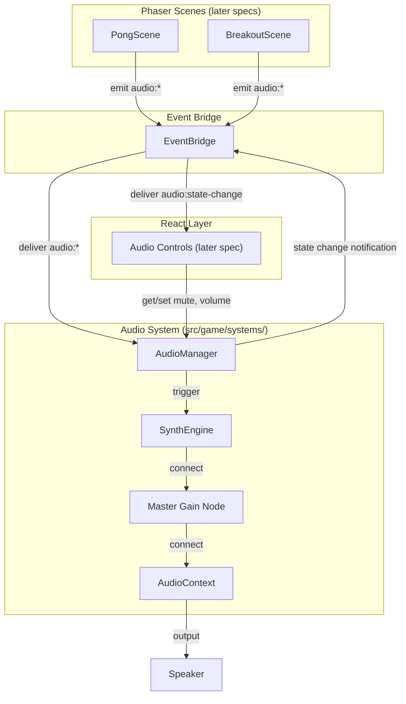

# Design Document — audio-system

## Overview

This spec delivers a synthesized Web Audio system that listens passively on the EventBridge and plays distinct programmatic sounds for all 9 named audio cues. The AudioManager lives in `src/game/systems/`, owns a single `AudioContext`, handles browser autoplay policy, and exposes mute/volume state for React UI consumption. No external audio assets are used — all sounds are generated with oscillators, gain envelopes, and noise buffers.

### Key Design Decisions

| Decision | Choice | ADR |
|----------|--------|-----|
| Audio engine | Web Audio API (direct) | [ADR-001](decisions/ADR-001-web-audio-api-vs-phaser-sound.md) |
| Integration pattern | EventBridge-driven (passive listener) | [ADR-002](decisions/ADR-002-eventbridge-driven-vs-direct-api.md) |

---

## Architecture



### Ownership Boundaries

| Concern | Owner | Location |
|---------|-------|----------|
| Audio event emission | Phaser scenes | `src/game/scenes/` (later specs) |
| Audio event transport | EventBridge | `src/game/systems/EventBridge.ts` |
| Sound synthesis & playback | AudioManager | `src/game/systems/AudioManager.ts` |
| Mute/volume UI controls | React components | `src/components/` (later spec) |
| AudioEventName type | Shared types | `src/game/types/audio.ts` |

### Integration Pattern

The AudioManager is a **passive listener**. It subscribes to audio events on the EventBridge during initialization and plays sounds when events arrive. Scenes emit audio events without importing or knowing about the AudioManager. This decoupling means:

- Scenes can be tested without audio
- Audio can be tested without scenes
- The audio system can be swapped or disabled without touching scene code
- Multiple listeners (e.g., visual feedback) can subscribe to the same audio events

### CSP Compatibility

The existing CSP in `index.html` already includes `media-src 'self' blob:` which covers Web Audio buffer usage. No CSP changes are needed for this spec.

---

## Components and Interfaces

### AudioManager

```typescript
// src/game/systems/AudioManager.ts

export interface AudioState {
  readonly muted: boolean;
  readonly volume: number;
}

export interface IAudioManager {
  /** Initialize the audio system — creates AudioContext, subscribes to EventBridge */
  init(): void;

  /** Destroy the audio system — closes context, unsubscribes, cleans up */
  destroy(): void;

  /** Get current mute state */
  isMuted(): boolean;

  /** Set mute state */
  setMuted(muted: boolean): void;

  /** Toggle mute state */
  toggleMute(): void;

  /** Get current volume level [0.0, 1.0] */
  getVolume(): number;

  /** Set volume level — clamped to [0.0, 1.0] */
  setVolume(volume: number): void;

  /** Get combined audio state snapshot */
  getState(): AudioState;
}
```

**Implementation details:**

- Singleton pattern matching EventBridge (module-level instance, default export)
- Creates `AudioContext` lazily on `init()` — not at import time
- Subscribes to all 9 `audio:*` events on the EventBridge
- Routes each event to the appropriate synthesis function
- Master gain node controls volume; mute disconnects or zeros the gain
- Emits `audio:state-change` on the EventBridge when mute or volume changes (for React re-rendering)

### SynthEngine (internal module)

```typescript
// src/game/systems/audio/SynthEngine.ts (internal, not exported from package)

import type { AudioEventName } from '../types/audio';

export type SynthFunction = (ctx: AudioContext, destination: AudioNode, time: number) => void;

/** Map of audio cue names to their synthesis functions */
export function getSynthFunctions(): Record<AudioEventName, SynthFunction>;
```

**Sound design approach:**

| Cue | Waveform | Frequency | Duration | Character |
|-----|----------|-----------|----------|-----------|
| `audio:paddle-hit` | Square | 220Hz → 440Hz sweep | ~80ms | Punchy click |
| `audio:wall-bounce` | Triangle | 330Hz | ~60ms | Soft thud |
| `audio:brick-break` | Sawtooth | 440Hz → 110Hz sweep down | ~120ms | Crunch |
| `audio:score-point` | Sine | 523Hz → 784Hz sweep up | ~200ms | Rising chime |
| `audio:life-loss` | Sawtooth | 200Hz → 80Hz sweep down | ~400ms | Descending buzz |
| `audio:powerup-pickup` | Sine | 660Hz → 880Hz → 1100Hz arpeggio | ~300ms | Sparkle arpeggio |
| `audio:pause` | Sine | 440Hz | ~150ms | Neutral tone |
| `audio:win` | Sine | C5→E5→G5→C6 arpeggio | ~800ms | Major chord arpeggio |
| `audio:loss` | Sawtooth | 200Hz → 100Hz → 50Hz | ~600ms | Descending drone |

Each synthesis function:
1. Creates oscillator(s) and gain node(s)
2. Connects to the provided destination node
3. Schedules start/stop using `AudioContext.currentTime`
4. Nodes are garbage-collected after playback completes (no manual cleanup needed for short one-shot sounds)

### EventMap Extension

```typescript
// Addition to src/game/types/events.ts
export type EventMap = {
  // ... existing events ...
  'audio:paddle-hit': undefined;
  'audio:wall-bounce': undefined;
  'audio:brick-break': undefined;
  'audio:score-point': undefined;
  'audio:life-loss': undefined;
  'audio:powerup-pickup': undefined;
  'audio:pause': undefined;
  'audio:win': undefined;
  'audio:loss': undefined;
  'audio:state-change': AudioState;
};
```

Audio events carry `undefined` payloads — the event name itself is the signal. The `audio:state-change` event carries the current `AudioState` for React consumption.

### Autoplay Policy Handler

```typescript
// Internal to AudioManager

private handleAutoplayPolicy(): void {
  if (this.audioContext.state === 'suspended') {
    const resume = () => {
      this.audioContext.resume();
      document.removeEventListener('click', resume);
      document.removeEventListener('keydown', resume);
    };
    document.addEventListener('click', resume, { once: true });
    document.addEventListener('keydown', resume, { once: true });
  }
}
```

**Behavior:**
- Checked during `init()` and after AudioContext creation
- Registers one-time listeners for click and keydown
- Removes listeners after successful resume
- While suspended, `playSound()` calls are silently skipped (no queue, no error)
- Cleanup removes these listeners if they haven't fired by destroy time

---

## Data Models

### AudioState

```typescript
interface AudioState {
  readonly muted: boolean;   // true = all output suppressed
  readonly volume: number;   // [0.0, 1.0], gain multiplier
}
```

**Default state:** `{ muted: false, volume: 1.0 }`

### Internal AudioManager State

```typescript
// Not exported — internal implementation detail
interface AudioManagerInternals {
  audioContext: AudioContext | null;
  masterGain: GainNode | null;
  muted: boolean;
  volume: number;
  initialized: boolean;
  handlers: Map<string, (payload: unknown) => void>;
  resumeListenerCleanup: (() => void) | null;
}
```

### Volume Clamping

```typescript
function clampVolume(value: number): number {
  return Math.max(0, Math.min(1, value));
}
```

---

## Error Handling

| Scenario | Behavior |
|----------|----------|
| AudioContext creation fails (rare, resource exhaustion) | `init()` catches error, sets `initialized = false`, logs warning. Audio silently disabled. |
| AudioContext is suspended (autoplay policy) | Registers resume listeners. Playback silently skipped until resumed. |
| `playSound()` called before `init()` | No-op. No error thrown. |
| `playSound()` called after `destroy()` | No-op. No error thrown. |
| Unrecognized audio event name | Ignored silently (defensive check in handler). |
| `setVolume()` with NaN or Infinity | Clamped to nearest bound (NaN → 0.0, Infinity → 1.0, -Infinity → 0.0). |
| Multiple rapid audio events | Each creates independent oscillator nodes — polyphonic by design. Web Audio handles concurrent nodes. |
| `destroy()` called multiple times | Idempotent. Second call is a no-op. |
| `init()` called after `destroy()` | Creates fresh AudioContext and re-subscribes. Full reset. |

---

## Testing Strategy

### Test Approach

Audio is imperative and browser-dependent. Testing focuses on:
1. **State management** (mute/volume) — pure logic, fully testable
2. **EventBridge integration** (subscribe/unsubscribe/dispatch) — testable with mocked AudioContext
3. **Lifecycle** (init/destroy/re-init) — testable with mocked AudioContext
4. **Synthesis functions** — tested via integration test verifying `play` was called with correct parameters

### Test File Locations

| File | Tests |
|------|-------|
| `src/game/systems/AudioManager.test.ts` | State management, EventBridge integration, lifecycle, autoplay handling |
| `src/game/systems/audio/SynthEngine.test.ts` | Each synth function creates expected node types and schedules correctly |

### What Is Tested

| Concern | Test Type | Approach |
|---------|-----------|----------|
| Mute defaults to false | Unit test | Assert `isMuted() === false` after init |
| Volume defaults to 1.0 | Unit test | Assert `getVolume() === 1.0` after init |
| setMuted(true) suppresses output | Unit test | Mock gain node, verify gain set to 0 |
| setVolume clamps to [0, 1] | Unit test | Pass out-of-range values, verify clamped |
| toggleMute flips state | Unit test | Toggle twice, verify returns to original |
| init subscribes to all 9 events | Unit test | Mock EventBridge.on, verify 9 calls |
| destroy unsubscribes all handlers | Unit test | Mock EventBridge.off, verify 9 calls |
| destroy closes AudioContext | Unit test | Mock AudioContext.close, verify called |
| Emit audio event → play called | Integration test | Emit event on real EventBridge, verify oscillator created on mock AudioContext |
| Muted state skips playback | Integration test | Set muted, emit event, verify no oscillator created |
| Autoplay resume on gesture | Unit test | Mock suspended context, simulate click, verify resume called |
| State change emits event | Unit test | Change mute/volume, verify `audio:state-change` emitted |
| Re-init after destroy works | Unit test | Destroy then init, verify fresh context created |

### What Is NOT Tested

- Actual audio output (requires real browser with speakers)
- Sound quality or perceptual distinctness (subjective, manual QA)
- Phaser scene integration (tested in later specs)
- React component rendering of audio controls (tested in `react-app-shell` spec)
- Performance under extreme event rates (manual stress testing if needed)

### Test Environment

- Standard Node environment with mocked `AudioContext` (Web Audio API is not available in Node)
- Mock `AudioContext` provides: `createOscillator()`, `createGain()`, `destination`, `currentTime`, `state`, `resume()`, `close()`
- Real `EventBridge` instance (it's pure TypeScript, works in Node)

### Property-Based Tests

No property-based tests are needed for this spec. Audio is imperative (trigger → play), not invariant-based. The volume clamping logic is trivial enough for example-based tests. The EventBridge round-trip property is already tested in `react-phaser-foundation`.

---

## Dependencies

| Dependency | Source | Purpose |
|------------|--------|---------|
| `EventBridge` | `react-phaser-foundation` spec | Event transport for audio triggers and state changes |
| `AudioEventName` type | `shared-types-and-rules` spec | Type-safe audio event names |
| `EventMap` type | `shared-types-and-rules` spec | Type registry for EventBridge (extended in this spec) |
| Web Audio API | Browser built-in | Sound synthesis and playback |

No new npm dependencies are required. The Web Audio API is built into all modern browsers.
