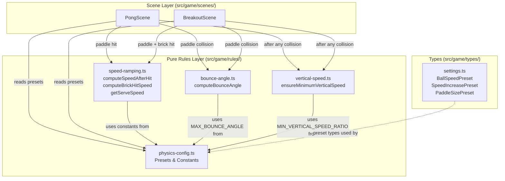
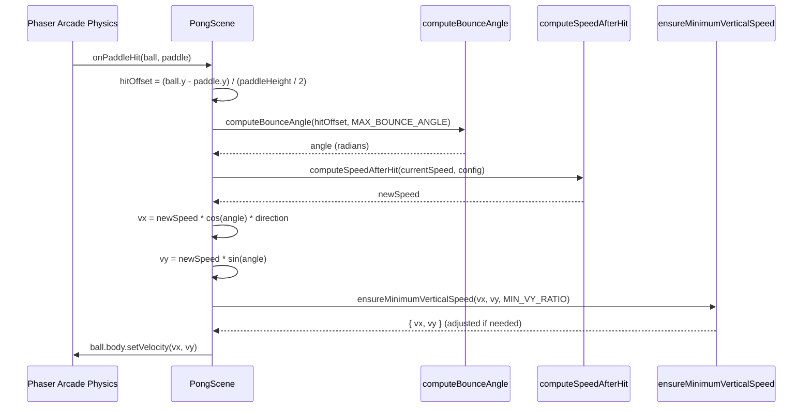

# Design Document: Ball Physics

## Overview

This design delivers a set of pure rule functions that give the ball satisfying, gamey physics across both Pong and Breakout modes. The core additions are:

1. **Bounce angle calculator** — determines outgoing ball direction based on paddle hit position
2. **Vertical speed enforcer** — prevents degenerate near-horizontal trajectories
3. **Physics config module** — centralizes all tunable constants with named presets
4. **Enhanced speed ramping** — preset-aware speed increase with brick-hit bonus for Breakout

All physics-feel logic lives as pure functions in `src/game/rules/`. Scenes consume these functions via collision callbacks and serve routines, reading configuration from the physics config module rather than hardcoding values.

The existing `ball-speed.ts` (`computeSpeedAfterHit`, `getServeSpeed`) will be replaced by the new physics config + speed ramping functions that accept preset-based configuration. The existing `paddle-physics.ts` (paddle Y movement) remains unchanged — bounce angle is a separate concern.

## Architecture



### Data Flow: Paddle Collision in PongScene



## Components and Interfaces

### `src/game/rules/physics-config.ts`

Centralized physics constants module. All values are `readonly` and grouped by preset.

```typescript
/** Ball speed preset names */
export type BallSpeedPreset = 'slow' | 'normal' | 'fast';

/** Speed increase preset names */
export type SpeedIncreasePreset = 'off' | 'gentle' | 'aggressive';

/** Paddle size preset names */
export type PaddleSizePreset = 'small' | 'normal' | 'large';

/** Speed configuration for a given combination of presets */
export interface SpeedConfig {
  readonly baseSpeed: number;
  readonly maxSpeed: number;
  readonly increment: number;
}

/** All physics constants */
export const PHYSICS = {
  /** Base speeds by ball speed preset (px/s) */
  BASE_SPEED: { slow: 220, normal: 300, fast: 400 } as const,

  /** Max speeds by ball speed preset (px/s) */
  MAX_SPEED: { slow: 400, normal: 550, fast: 700 } as const,

  /** Speed increments by speed increase preset (px/s per hit) */
  SPEED_INCREMENT: { off: 0, gentle: 20, aggressive: 45 } as const,

  /** Paddle heights by paddle size preset (px) */
  PADDLE_HEIGHT: { small: 60, normal: 100, large: 140 } as const,

  /** Maximum bounce angle from paddle edge (radians, ~60°) */
  MAX_BOUNCE_ANGLE: Math.PI / 3,

  /** Minimum vertical speed as fraction of total speed */
  MIN_VERTICAL_SPEED_RATIO: 0.15,

  /** Additional speed bump when breaking a brick in Breakout (px/s) */
  BRICK_HIT_SPEED_BUMP: 8,

  /** Serve delay in milliseconds */
  SERVE_DELAY_MS: 750,
} as const;

/**
 * Resolves a SpeedConfig from the given presets.
 */
export function getSpeedConfig(
  ballSpeed: BallSpeedPreset,
  speedIncrease: SpeedIncreasePreset,
): SpeedConfig;
```

### `src/game/rules/bounce-angle.ts`

Pure function for paddle-relative bounce angle calculation.

```typescript
/**
 * Computes the outgoing bounce angle based on where the ball hit the paddle.
 *
 * @param hitOffset - Signed distance from paddle center, normalized.
 *   Positive = below center (Pong) or right of center (Breakout).
 *   Values outside [-1, 1] are clamped.
 * @param maxAngle - Maximum deflection angle in radians (e.g., π/3).
 * @returns Angle in radians in the range [-maxAngle, maxAngle].
 */
export function computeBounceAngle(
  hitOffset: number,
  maxAngle: number,
): number;
```

### `src/game/rules/vertical-speed.ts`

Pure function for degenerate trajectory prevention.

```typescript
export interface Velocity {
  readonly vx: number;
  readonly vy: number;
}

/**
 * Ensures the ball's vertical velocity component meets a minimum ratio
 * of total speed. If it doesn't, adjusts vy upward while preserving
 * total speed magnitude and vy sign.
 *
 * @param vx - Horizontal velocity component
 * @param vy - Vertical velocity component
 * @param minVyRatio - Minimum |vy| as fraction of total speed (0 to 1)
 * @returns Adjusted velocity preserving total speed magnitude
 */
export function ensureMinimumVerticalSpeed(
  vx: number,
  vy: number,
  minVyRatio: number,
): Velocity;
```

### `src/game/rules/speed-ramping.ts`

Enhanced speed ramping functions replacing the existing `ball-speed.ts`.

```typescript
import type { SpeedConfig } from './physics-config';

/**
 * Computes new ball speed after a paddle hit.
 * Adds the preset increment, caps at maxSpeed.
 * Returns currentSpeed unchanged if increment is 0 (Off preset).
 */
export function computeSpeedAfterHit(
  currentSpeed: number,
  config: SpeedConfig,
): number;

/**
 * Computes new ball speed after a brick hit in Breakout.
 * Adds both the preset increment AND the brick-hit speed bump.
 * Caps at maxSpeed.
 */
export function computeBrickHitSpeed(
  currentSpeed: number,
  config: SpeedConfig,
  brickBump: number,
): number;

/**
 * Returns the serve speed (base speed) for the active preset.
 * Used when resetting speed after a point (Pong) or life loss (Breakout).
 */
export function getServeSpeed(config: SpeedConfig): number;
```

## Data Models

### Preset Types (added to `src/game/types/settings.ts`)

```typescript
export type BallSpeedPreset = 'slow' | 'normal' | 'fast';
export type SpeedIncreasePreset = 'off' | 'gentle' | 'aggressive';
export type PaddleSizePreset = 'small' | 'normal' | 'large';
```

### Extended Match Settings

```typescript
interface MatchSettingsBase {
  readonly powerupsEnabled: boolean;
  readonly ballSpeedPreset: BallSpeedPreset;
  readonly paddleSizePreset: PaddleSizePreset;
  readonly speedIncreasePreset: SpeedIncreasePreset;
}

export interface PongSoloSettings extends MatchSettingsBase {
  readonly mode: 'pong-solo';
  readonly winScore: number;
  readonly aiDifficulty: AIDifficultyPreset;
}

export interface PongVersusSettings extends MatchSettingsBase {
  readonly mode: 'pong-versus';
  readonly winScore: number;
}

export interface BreakoutSettings extends MatchSettingsBase {
  readonly mode: 'breakout';
  readonly startingLives: 1 | 3 | 5;
  readonly brickDensity: 'sparse' | 'normal' | 'dense';
}
```

### SpeedConfig (runtime resolved)

```typescript
export interface SpeedConfig {
  readonly baseSpeed: number;   // px/s — serve speed and reset speed
  readonly maxSpeed: number;    // px/s — absolute cap
  readonly increment: number;   // px/s — added per hit (0 when Off)
}
```

### Velocity (used by vertical speed enforcer)

```typescript
export interface Velocity {
  readonly vx: number;
  readonly vy: number;
}
```

## Correctness Properties

*A property is a characteristic or behavior that should hold true across all valid executions of a system — essentially, a formal statement about what the system should do. Properties serve as the bridge between human-readable specifications and machine-verifiable correctness guarantees.*

### Property 1: Bounce angle linearity and bounds

*For any* hitOffset value (including values outside [-1, 1]) and any positive maxAngle, `computeBounceAngle(hitOffset, maxAngle)` SHALL return `clamp(hitOffset, -1, 1) * maxAngle`, and the absolute value of the result SHALL not exceed maxAngle.

**Validates: Requirements 1.1, 1.2, 1.3, 1.4, 1.5, 1.6, 8.1**

### Property 2: Vertical speed enforcer minimum guarantee

*For any* velocity pair (vx, vy) where total speed is greater than zero, `ensureMinimumVerticalSpeed(vx, vy, minVyRatio)` SHALL return a velocity whose vertical component absolute value is greater than or equal to `minVyRatio * totalSpeed`.

**Validates: Requirements 2.1, 2.5, 8.2**

### Property 3: Vertical speed enforcer preserves total speed

*For any* velocity pair (vx, vy) where total speed is greater than zero, `ensureMinimumVerticalSpeed(vx, vy, minVyRatio)` SHALL return a velocity whose total magnitude (sqrt(vx² + vy²)) equals the input total magnitude within floating-point tolerance (±1e-9).

**Validates: Requirements 2.3, 8.3**

### Property 4: Vertical speed enforcer preserves sign

*For any* velocity pair (vx, vy) where vy is not zero, `ensureMinimumVerticalSpeed(vx, vy, minVyRatio)` SHALL return a velocity whose vy has the same sign as the input vy.

**Validates: Requirements 2.2**

### Property 5: Speed ramping never exceeds max

*For any* valid currentSpeed ≥ 0 and any SpeedConfig with positive baseSpeed, maxSpeed, and non-negative increment, `computeSpeedAfterHit(currentSpeed, config)` SHALL return a value that does not exceed `config.maxSpeed`.

**Validates: Requirements 4.1, 4.2, 4.3, 4.4, 8.4**

### Property 6: Speed ramping identity when Off

*For any* valid currentSpeed ≥ 0 and any SpeedConfig where increment equals 0, `computeSpeedAfterHit(currentSpeed, config)` SHALL return a value equal to `min(currentSpeed, config.maxSpeed)`.

**Validates: Requirements 4.5, 8.5**

### Property 7: Brick hit speed bump never exceeds max

*For any* valid currentSpeed ≥ 0, any SpeedConfig, and any non-negative brickBump, `computeBrickHitSpeed(currentSpeed, config, brickBump)` SHALL return a value that does not exceed `config.maxSpeed`.

**Validates: Requirements 5.1, 5.2, 5.3**

## Error Handling

The pure rule functions are designed to be robust against edge-case inputs:

| Function | Edge Case | Handling |
|----------|-----------|----------|
| `computeBounceAngle` | hitOffset outside [-1, 1] | Clamp to [-1, 1] before computing |
| `computeBounceAngle` | maxAngle ≤ 0 | Return 0 (no deflection) |
| `ensureMinimumVerticalSpeed` | Total speed = 0 (stationary ball) | Return { vx: 0, vy: 0 } unchanged |
| `ensureMinimumVerticalSpeed` | vy = 0 (perfectly horizontal) | Assign positive vy at minimum ratio, recompute vx to preserve speed |
| `ensureMinimumVerticalSpeed` | minVyRatio ≥ 1 | Clamp to 0.99 to avoid impossible constraint |
| `computeSpeedAfterHit` | currentSpeed > maxSpeed | Return maxSpeed (cap) |
| `computeBrickHitSpeed` | currentSpeed > maxSpeed | Return maxSpeed (cap) |
| `getSpeedConfig` | Invalid preset string | TypeScript union types prevent this at compile time |

Scenes handle the special case where `vy = 0` after a collision by relying on `ensureMinimumVerticalSpeed` to inject a positive vy direction (defaulting to the ball's last known vertical direction, or positive if truly unknown).

No exceptions are thrown by physics functions. All inputs produce valid outputs through clamping and defaulting.

## Testing Strategy

### Unit Tests

Unit tests cover specific examples and integration points:

- `physics-config.test.ts`: Verify all presets exist, `getSpeedConfig` returns correct values for all 9 combinations, constants are within sensible ranges (e.g., baseSpeed < maxSpeed for each preset)
- `bounce-angle.test.ts`: Center hit returns 0, edge hit returns ±maxAngle, clamping works for out-of-range inputs
- `vertical-speed.test.ts`: Already-valid velocity passes through unchanged, zero-speed input returns zero, vy=0 case gets corrected
- `speed-ramping.test.ts`: Increment adds correctly, cap works at boundary, serve speed returns baseSpeed for each preset, brick bump adds on top of increment

### Property-Based Tests (fast-check)

Property-based tests verify universal invariants with minimum 100 iterations each. Each test references its design property.

| Test File | Property | Iterations |
|-----------|----------|------------|
| `bounce-angle.test.ts` | Property 1: Linearity and bounds | 200 |
| `vertical-speed.test.ts` | Property 2: Minimum vertical guarantee | 200 |
| `vertical-speed.test.ts` | Property 3: Total speed preservation | 200 |
| `vertical-speed.test.ts` | Property 4: Sign preservation | 200 |
| `speed-ramping.test.ts` | Property 5: Never exceeds max | 200 |
| `speed-ramping.test.ts` | Property 6: Identity when Off | 200 |
| `speed-ramping.test.ts` | Property 7: Brick hit never exceeds max | 200 |

**Tag format:** `Feature: ball-physics, Property N: <property_text>`

**Library:** `fast-check` (already in devDependencies)

### Integration Verification

Scene integration (Requirements 7.x) is verified through:
- Code review: scenes import and call pure functions, no hardcoded physics constants
- Manual play-test: ball angle varies with paddle hit position, speed ramps up, no degenerate trajectories
- Existing scene tests continue to pass after wiring changes

### Migration from `ball-speed.ts`

The existing `ball-speed.ts` and its tests will be replaced by `speed-ramping.ts`. The new module provides the same `computeSpeedAfterHit` and `getServeSpeed` signatures (with the enhanced `SpeedConfig` type) plus the new `computeBrickHitSpeed`. Scenes that currently import from `ball-speed.ts` will be updated to import from `speed-ramping.ts` with the new config structure.
