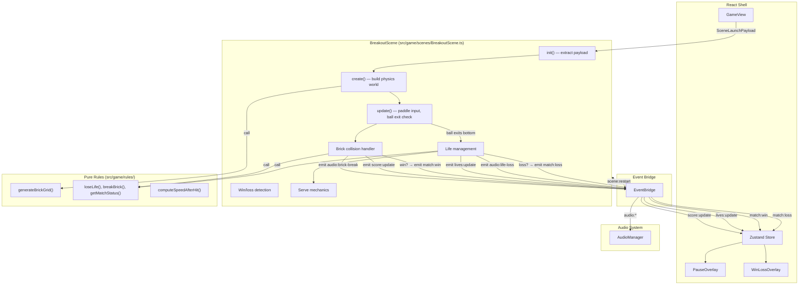

# Design Document — breakout-core

## Overview

This spec implements `BreakoutScene`, the second playable Phaser scene in the paddle arcade. It creates a complete Breakout match using Arcade Physics — ball, paddle, walls, brick grid, scoring, lives, and win/loss detection. The scene delegates brick-grid generation and life/win/loss logic to existing pure rules, emits typed events via EventBridge, and triggers audio cues for all gameplay moments. It follows all critical implementation patterns learned from pong-core bugs (SceneLauncher, window keyboard listeners, immediate ball repositioning on life loss, serve delay).

### Key Design Decisions

| Decision | Choice | ADR |
|----------|--------|-----|
| Ball speed increase configurability | Scene-level boolean constant (default enabled) | [ADR-001](decisions/ADR-001-ball-speed-configurability.md) |
| Score event format | Reuse `score:update` with `{ left: score, right: 0 }` | [ADR-002](decisions/ADR-002-score-event-format.md) |

---

## Architecture



### Ownership Boundaries

| Concern | Owner | Location |
|---------|-------|----------|
| Ball/paddle/wall/brick creation & physics | BreakoutScene | `src/game/scenes/BreakoutScene.ts` |
| Keyboard input processing | BreakoutScene | `src/game/scenes/BreakoutScene.ts` |
| Collision detection & response | BreakoutScene (Phaser Arcade) | `src/game/scenes/BreakoutScene.ts` |
| Brick grid generation | Pure rule | `src/game/rules/brick-grid.ts` |
| Life/score/win/loss state transitions | Pure rule | `src/game/rules/life-rules.ts` |
| Ball speed computation | Pure rule | `src/game/rules/ball-speed.ts` |
| Event emission to React | BreakoutScene via EventBridge | `src/game/systems/EventBridge.ts` |
| Pause/restart listeners | BreakoutScene subscribes | `src/game/systems/EventBridge.ts` |
| Audio playback | AudioManager (passive) | `src/game/systems/AudioManager.ts` |
| Score/lives display, overlays | React shell (existing) | `src/components/` |
| Scene selection by mode | GameView | `src/components/GameView.tsx` |

---

## Components and Interfaces

### BreakoutScene Class

```typescript
// src/game/scenes/BreakoutScene.ts

import Phaser from 'phaser';
import eventBridge from '../systems/EventBridge';
import { getLaunchPayload } from '../systems/SceneLauncher';
import { generateBrickGrid, type BrickGridConfig, type BrickDescriptor } from '../rules/brick-grid';
import { createInitialState, loseLife, breakBrick, getMatchStatus, type BreakoutState } from '../rules/life-rules';
import { computeSpeedAfterHit } from '../rules/ball-speed';
import type { SceneLaunchPayload } from '../types/payload';

export default class BreakoutScene extends Phaser.Scene {
  // Physics bodies
  private ball!: Phaser.GameObjects.Arc & { body: Phaser.Physics.Arcade.Body };
  private paddle!: Phaser.GameObjects.Rectangle & { body: Phaser.Physics.Arcade.Body };
  private topWall!: Phaser.GameObjects.Rectangle & { body: Phaser.Physics.Arcade.StaticBody };
  private leftWall!: Phaser.GameObjects.Rectangle & { body: Phaser.Physics.Arcade.StaticBody };
  private rightWall!: Phaser.GameObjects.Rectangle & { body: Phaser.Physics.Arcade.StaticBody };
  private bricks!: Phaser.Physics.Arcade.StaticGroup;

  // Input state (window listeners)
  private keyState: { left: boolean; right: boolean };

  // Match state
  private breakoutState!: BreakoutState;
  private matchOver: boolean;
  private paused: boolean;
  private currentSpeed: number;
  private speedIncreaseEnabled: boolean;

  constructor();
  init(data?: SceneLaunchPayload): void;
  create(): void;
  update(time: number, delta: number): void;
  shutdown(): void;
}
```

---

## Data Models

### Scene Constants

```typescript
const BREAKOUT = {
  // Play area
  GAME_WIDTH: 800,
  GAME_HEIGHT: 600,

  // Paddle
  PADDLE_WIDTH: 100,
  PADDLE_HEIGHT: 16,
  PADDLE_Y: 560,            // Y position (near bottom)
  PADDLE_SPEED: 500,        // pixels per second

  // Ball
  BALL_RADIUS: 8,

  // Ball speed
  BASE_SPEED: 300,
  SPEED_INCREMENT: 15,      // smaller than Pong — more hits in Breakout
  MAX_SPEED: 550,

  // Walls
  WALL_THICKNESS: 16,

  // Brick grid
  BRICK_ROWS: 5,
  BRICK_COLUMNS: 10,
  BRICK_TOP_OFFSET: 80,     // space above first row
  BRICK_PADDING: 4,
  BRICK_AREA_HEIGHT: 200,   // vertical space allocated for bricks

  // Scoring
  POINTS_PER_BRICK: 10,

  // Serve
  SERVE_DELAY_MS: 750,

  // Speed increase
  SPEED_INCREASE_ENABLED: true,  // configurable default
} as const;
```

### Match State

```typescript
interface BreakoutMatchState {
  breakoutState: BreakoutState;  // { lives, bricksRemaining, score }
  matchOver: boolean;
  paused: boolean;
  currentSpeed: number;
  speedIncreaseEnabled: boolean;
}
```

---

## Scene Lifecycle

### init(data)

1. Read payload from SceneLauncher (primary) or `data` parameter (fallback).
2. Extract `speedIncreaseEnabled` from settings or use default (`true`).
3. Set `matchOver = false`, `paused = false`.
4. Set `currentSpeed = BASE_SPEED`.
5. Note: `breakoutState` is initialized in `create()` after brick grid generation (need total brick count).

### create()

1. Set background color to `#111111`.
2. Create top Wall (static body, full width).
3. Create left Wall (static body, full height).
4. Create right Wall (static body, full height).
5. Generate brick grid using `generateBrickGrid` with config:
   - `rows: BRICK_ROWS`, `columns: BRICK_COLUMNS`
   - `playAreaWidth: GAME_WIDTH - 2 * WALL_THICKNESS`
   - `playAreaHeight: BRICK_AREA_HEIGHT`
   - `topOffset: BRICK_TOP_OFFSET`
   - `padding: BRICK_PADDING`
6. Create a `Phaser.Physics.Arcade.StaticGroup` for bricks.
7. For each `BrickDescriptor`, create a colored rectangle and add to the static group.
8. Initialize `breakoutState` using `createInitialState(totalBricks)`.
9. Create Paddle (dynamic, immovable, no gravity).
10. Create Ball (dynamic, no gravity, bounce 1, circle body, maxSpeed set).
11. Position Ball on top of Paddle.
12. Add colliders: Ball ↔ Walls, Ball ↔ Paddle, Ball ↔ Bricks.
13. Register collision callbacks.
14. Register window keyboard listeners (ArrowLeft, ArrowRight, A, D).
15. Subscribe to `match:pause` and `scene:restart` on EventBridge.
16. Register `shutdown` event listener.
17. Emit initial `lives:update` with starting lives (3).
18. Emit initial `score:update` with `{ left: 0, right: 0 }`.
19. Schedule first serve after `SERVE_DELAY_MS`.

### update(time, delta)

1. If `matchOver` or `paused`, return early.
2. Read keyboard state, set paddle velocity (left/right/stop).
3. Clamp paddle X to horizontal bounds.
4. Check if Ball Y has exited the bottom edge (below `GAME_HEIGHT`).
5. If Ball exited bottom: trigger life loss flow.

### shutdown()

1. Unsubscribe `match:pause` and `scene:restart` handlers from EventBridge.
2. Remove window keyboard listeners.
3. Clear references.

---

## Collision Handling

### Ball ↔ Paddle

Handled by Phaser Arcade Physics collider with a callback:

1. Emit `audio:paddle-hit` via EventBridge.
2. If `speedIncreaseEnabled`:
   - Increase `currentSpeed` using `computeSpeedAfterHit`.
   - Normalize ball velocity and scale to `currentSpeed`.
3. Apply angle variation based on where the ball hits the paddle (offset from center → angle adjustment) to give the player directional control.

### Ball ↔ Wall

Handled by Phaser Arcade Physics collider with a callback:

1. Emit `audio:wall-bounce` via EventBridge.
2. Phaser Arcade handles velocity reflection automatically.

### Ball ↔ Brick

Handled by Phaser Arcade Physics collider with a callback:

1. Destroy the brick (remove from group and display).
2. Call `breakBrick(breakoutState, POINTS_PER_BRICK)` → update state.
3. Emit `score:update` with `{ left: breakoutState.score, right: 0 }`.
4. Emit `audio:brick-break`.
5. Call `getMatchStatus(breakoutState)`:
   - If `'win'` → trigger win flow.

---

## Life Loss Flow

Triggered when Ball Y exceeds `GAME_HEIGHT` (exits bottom):

1. Immediately reposition Ball on top of Paddle (`ball.setPosition(paddle.x, PADDLE_Y - BALL_RADIUS - PADDLE_HEIGHT/2)`).
2. Stop Ball velocity (`ball.body.setVelocity(0, 0)`).
3. Call `loseLife(breakoutState)` → update state.
4. Reset `currentSpeed` to `BASE_SPEED`.
5. Emit `lives:update` with `{ remaining: breakoutState.lives }`.
6. Emit `audio:life-loss`.
7. Call `getMatchStatus(breakoutState)`:
   - If `'loss'` → trigger loss flow.
   - If `'in-progress'` → schedule serve after `SERVE_DELAY_MS`.

---

## Serve Flow

1. Position Ball on top of Paddle (centered on current paddle X).
2. Set `currentSpeed = BASE_SPEED`.
3. Compute velocity: upward with slight random horizontal angle.
   - Vertical component: `-1` (upward).
   - Horizontal component: random between `-0.4` and `0.4`.
   - Normalize and scale to `BASE_SPEED`.
4. Set Ball velocity.

The random horizontal component prevents predictable straight serves while keeping the ball moving primarily upward.

---

## Win Flow

1. Set `matchOver = true`.
2. Stop Ball velocity.
3. Emit `match:win` with `{ winner: 'solo' }`.
4. Emit `audio:win`.

---

## Loss Flow

1. Set `matchOver = true`.
2. Stop Ball velocity.
3. Emit `match:loss` with `{ finalScore: breakoutState.score }`.
4. Emit `audio:loss`.

---

## Pause Integration

### Receiving Pause

```typescript
private handlePause = (payload: { paused: boolean }): void => {
  this.paused = payload.paused;
  if (payload.paused) {
    this.physics.pause();
    eventBridge.emit('audio:pause');
  } else {
    this.physics.resume();
  }
};
```

- Subscribe in `create()`: `eventBridge.on('match:pause', this.handlePause)`
- Unsubscribe in `shutdown()`: `eventBridge.off('match:pause', this.handlePause)`

### Input During Pause

The `update()` method returns early when `paused === true`, so paddle input is naturally ignored.

---

## Scene Restart Integration

```typescript
private handleRestart = (): void => {
  this.scene.restart();
};
```

- Subscribe in `create()`: `eventBridge.on('scene:restart', this.handleRestart)`
- `scene.restart()` re-runs `init()` + `create()` with fresh state, re-reading from SceneLauncher.

---

## GameView Integration

The existing `GameView` component needs modification to support BreakoutScene:

```typescript
// In postBoot callback, select scene based on mode:
postBoot: (g: Phaser.Game) => {
  if (payload.settings.mode === 'breakout') {
    g.scene.add('BreakoutScene', BreakoutScene, true, payload);
  } else {
    g.scene.add('PongScene', PongScene, true, payload);
  }
}
```

The existing `lives:update` and `match:loss` EventBridge subscriptions in GameView already handle Breakout events — no new subscriptions needed.

---

## Paddle Angle Control

To give the player directional control over the ball, the paddle collision callback adjusts the ball's horizontal velocity based on where the ball hits the paddle:

```typescript
// In onPaddleHit callback:
const hitOffset = (ball.x - paddle.x) / (PADDLE_WIDTH / 2); // -1 to +1
const angle = hitOffset * (Math.PI / 3); // max ±60° from vertical
const speed = this.currentSpeed;
ball.body.setVelocity(
  speed * Math.sin(angle),
  -speed * Math.cos(angle)  // always upward after paddle hit
);
```

This ensures:
- Hitting the paddle center sends the ball straight up.
- Hitting the paddle edges sends the ball at an angle.
- The ball always moves upward after a paddle hit.

---

## Programmatic Rendering

All game objects are drawn programmatically — no external image assets.

| Object | Rendering |
|--------|-----------|
| Ball | White filled circle, radius 8px |
| Paddle | White filled rectangle, 100×16px |
| Walls | Dark gray filled rectangles (top: full width × 16px, sides: 16px × full height) |
| Bricks | Colored rectangles with row-based color gradient (e.g., red → orange → yellow → green → cyan) |
| Background | Scene background color `#111111` |

Visual polish (glow, particles) is deferred to the `neon-visuals` spec.

### Brick Colors by Row

```typescript
const BRICK_COLORS = [
  0xff4444, // row 0 — red
  0xff8844, // row 1 — orange
  0xffcc44, // row 2 — yellow
  0x44ff44, // row 3 — green
  0x44ccff, // row 4 — cyan
];
```

---

## Error Handling

| Scenario | Behavior |
|----------|----------|
| Missing SceneLaunchPayload | Use defaults: speedIncreaseEnabled=true, powerupsEnabled=false |
| Empty brick grid (0 rows/columns) | Match immediately wins (0 bricks remaining) |
| Keyboard keys unavailable | Graceful no-op |
| EventBridge emit during shutdown | No-op (EventBridge handles missing listeners) |
| Rapid pause/unpause | Physics pause/resume is idempotent in Phaser |
| Ball stuck in corner | MaxSpeed cap + bounce factor 1 prevents infinite loops |
| Multiple brick collisions in one frame | Each collision callback fires independently; state updates are sequential |

---

## Testing Strategy

### Test Approach

BreakoutScene is a Phaser scene — it cannot be unit-tested in Node without a browser. Testing focuses on:

1. **Pure rule modules** — fully testable in Vitest (already tested in shared-types-and-rules)
2. **Property-based tests** — for brick grid invariants
3. **Integration** — verified by manual play + existing shell event tests

### Existing Tests (from shared-types-and-rules)

| File | Tests |
|------|-------|
| `src/game/rules/brick-grid.test.ts` | Brick grid generation, bounds, no overlap |
| `src/game/rules/life-rules.test.ts` | Life transitions, win/loss detection |
| `src/game/rules/ball-speed.test.ts` | Speed computation, bounds |

### New Property-Based Tests

| Property | Module | Invariant |
|----------|--------|-----------|
| Brick grid fits within play area | `brick-grid` | For all valid configs, every brick x+width ≤ playAreaWidth and y+height ≤ playAreaHeight |
| Brick grid has no overlaps | `brick-grid` | For all valid configs, no two bricks share any pixel area |
| Brick count equals rows × columns | `brick-grid` | For all valid configs, result length === rows × columns |
| Ball speed stays within bounds | `ball-speed` | For all hit sequences, speed ∈ [baseSpeed, maxSpeed] |

### What Is NOT Tested

- Full Phaser scene rendering (no browser test layer in v1)
- Visual appearance of game objects (manual QA)
- Audio output (tested by audio-system spec)
- React overlay behavior (tested by react-app-shell spec)
- Phaser collision detection accuracy (trust Phaser Arcade)

### Test Tags

```
Feature: breakout-core, Property 1: brick grid fits within play area bounds for any valid config
Feature: breakout-core, Property 2: brick grid has no overlapping bricks for any valid config
Feature: breakout-core, Property 3: brick count equals rows × columns for any valid config
Feature: breakout-core, Property 4: ball speed stays within [baseSpeed, maxSpeed] for any hit sequence
```

---

## Dependencies

| Dependency | Source | Purpose |
|------------|--------|---------|
| `generateBrickGrid` | `src/game/rules/brick-grid.ts` | Brick position/size computation |
| `createInitialState`, `loseLife`, `breakBrick`, `getMatchStatus` | `src/game/rules/life-rules.ts` | Life/score/win/loss state management |
| `computeSpeedAfterHit` | `src/game/rules/ball-speed.ts` | Ball speed increase on paddle hit |
| `EventBridge` | `src/game/systems/EventBridge.ts` | Event emission and pause/restart subscription |
| `SceneLauncher` | `src/game/systems/SceneLauncher.ts` | Payload reading in init() |
| `AudioManager` | `src/game/systems/AudioManager.ts` | Passive audio (no direct import needed) |
| `SceneLaunchPayload` | `src/game/types/payload.ts` | Scene initialization contract |
| `BreakoutSettings` | `src/game/types/settings.ts` | Mode-specific settings type |
| `EventMap` | `src/game/types/events.ts` | Type-safe event emission |
| Phaser 3 Arcade Physics | npm `phaser` | Physics simulation |

No new npm dependencies required.
