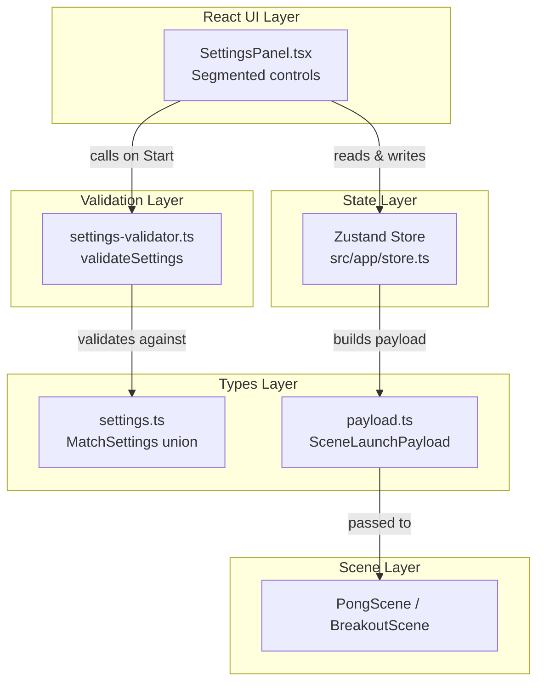
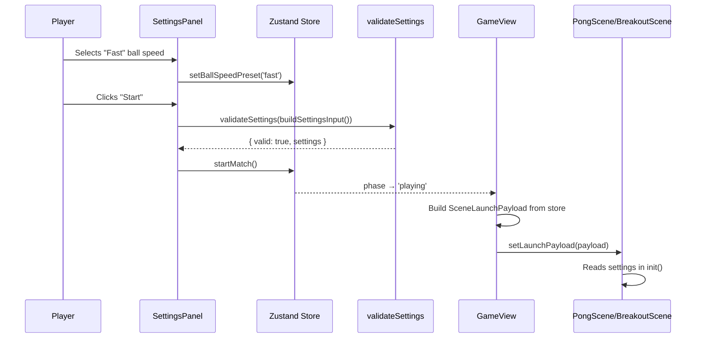

# Design Document: Extended Settings

## Overview

This design extends the pre-match settings flow to expose ball speed, paddle size, speed increase (Pong), starting lives, and brick density (Breakout) as player-configurable options. The changes span four layers:

1. **Types** — extend `MatchSettings` discriminated union with new preset fields
2. **Store** — add state, defaults, and setter actions to the Zustand store
3. **Validator** — extend the pure `validateSettings` function to enforce valid preset values
4. **UI** — add segmented controls to `SettingsPanel`, grouped into "Match Rules" and "Feel" sections

The `ball-physics` spec already defines `BallSpeedPreset`, `SpeedIncreasePreset`, and `PaddleSizePreset` types plus the physics config module that maps presets to runtime values. This spec wires those presets into the player-facing configuration flow and adds two new types: `BrickDensityPreset` and `StartingLives`.

The `SceneLaunchPayload` carries the full validated `MatchSettings` to Phaser scenes — no additional payload changes are needed beyond the type extension since the payload already uses the `MatchSettings` union.

## Architecture



### Data Flow: Settings → Scene Launch



## Components and Interfaces

### Type Extensions (`src/game/types/settings.ts`)

New preset types added alongside existing types:

```typescript
// Already defined by ball-physics spec:
export type BallSpeedPreset = 'slow' | 'normal' | 'fast';
export type SpeedIncreasePreset = 'off' | 'gentle' | 'aggressive';
export type PaddleSizePreset = 'small' | 'normal' | 'large';

// New to this spec:
export type BrickDensityPreset = 'sparse' | 'normal' | 'dense';
export type StartingLives = 1 | 3 | 5;
```

Extended `MatchSettingsBase`:

```typescript
interface MatchSettingsBase {
  readonly powerupsEnabled: boolean;
  readonly ballSpeedPreset: BallSpeedPreset;
  readonly paddleSizePreset: PaddleSizePreset;
  readonly speedIncreasePreset: SpeedIncreasePreset;
}
```

Extended `BreakoutSettings`:

```typescript
export interface BreakoutSettings extends MatchSettingsBase {
  readonly mode: 'breakout';
  readonly startingLives: StartingLives;
  readonly brickDensity: BrickDensityPreset;
}
```

`PongSoloSettings` and `PongVersusSettings` inherit the new base fields without additional changes beyond what they already have.

### Store Extensions (`src/app/store.ts`)

New state fields with defaults:

| Field | Type | Default |
|-------|------|---------|
| `ballSpeedPreset` | `BallSpeedPreset` | `'normal'` |
| `paddleSizePreset` | `PaddleSizePreset` | `'normal'` |
| `speedIncreasePreset` | `SpeedIncreasePreset` | `'gentle'` |
| `startingLives` | `StartingLives` | `3` |
| `brickDensity` | `BrickDensityPreset` | `'normal'` |

New setter actions (all reject changes when `phase === 'playing'`):

```typescript
setBallSpeedPreset: (preset: BallSpeedPreset) => void;
setPaddleSizePreset: (preset: PaddleSizePreset) => void;
setSpeedIncreasePreset: (preset: SpeedIncreasePreset) => void;
setStartingLives: (lives: StartingLives) => void;
setBrickDensity: (density: BrickDensityPreset) => void;
```

The `goToMenu` action resets all new fields to their defaults alongside existing reset behavior.

### Settings Validator Extensions (`src/game/rules/settings-validator.ts`)

The validator gains checks for the three new base fields on all modes, plus `startingLives` and `brickDensity` for breakout:

```typescript
// Allowed values (used for runtime validation)
const VALID_BALL_SPEED: readonly string[] = ['slow', 'normal', 'fast'];
const VALID_PADDLE_SIZE: readonly string[] = ['small', 'normal', 'large'];
const VALID_SPEED_INCREASE: readonly string[] = ['off', 'gentle', 'aggressive'];
const VALID_BRICK_DENSITY: readonly string[] = ['sparse', 'normal', 'dense'];
const VALID_STARTING_LIVES: readonly number[] = [1, 3, 5];
```

Validation logic:
- For all modes: reject if `ballSpeedPreset`, `paddleSizePreset`, or `speedIncreasePreset` is missing or not in the allowed set.
- For breakout: additionally reject if `startingLives` is not in `[1, 3, 5]` or `brickDensity` is not in the allowed set.
- When valid, return a new settings object with all fields preserved (no clamping needed for enum-like presets).

### SettingsPanel UI (`src/components/SettingsPanel.tsx`)

The panel is restructured with section headings:

**Pong modes (`pong-solo` / `pong-versus`):**
- **Match Rules** section: Win Score input, AI Difficulty (solo only)
- **Feel** section: Ball Speed, Paddle Size, Ball Speed Increase
- Powerups toggle (below sections)

**Breakout mode:**
- **Match Rules** section: Starting Lives
- **Feel** section: Ball Speed, Paddle Size, Brick Density
- Powerups toggle (below sections)

Each new setting uses a `SegmentedControl` pattern matching the existing AI difficulty selector:
- Row of buttons with `segmented__btn` / `segmented__btn--active` classes
- Each button is a native `<button>` element (inherently focusable)
- Active state indicated visually via the `--active` modifier class
- Keyboard: Tab navigates between controls; Enter/Space activates the focused button

### SceneLaunchPayload (`src/game/types/payload.ts`)

No structural changes needed. The payload already carries `settings: MatchSettings`, and since `MatchSettings` is extended with new fields, the payload automatically includes them. Scenes access presets via `payload.settings.ballSpeedPreset`, etc.

## Data Models

### Complete MatchSettings Union (after extension)

```typescript
interface MatchSettingsBase {
  readonly powerupsEnabled: boolean;
  readonly ballSpeedPreset: BallSpeedPreset;
  readonly paddleSizePreset: PaddleSizePreset;
  readonly speedIncreasePreset: SpeedIncreasePreset;
}

export interface PongSoloSettings extends MatchSettingsBase {
  readonly mode: 'pong-solo';
  readonly winScore: number;
  readonly aiDifficulty: AIDifficultyPreset;
}

export interface PongVersusSettings extends MatchSettingsBase {
  readonly mode: 'pong-versus';
  readonly winScore: number;
}

export interface BreakoutSettings extends MatchSettingsBase {
  readonly mode: 'breakout';
  readonly startingLives: StartingLives;
  readonly brickDensity: BrickDensityPreset;
}

export type MatchSettings = PongSoloSettings | PongVersusSettings | BreakoutSettings;
```

### Store State Shape (new fields only)

```typescript
// Added to AppState interface
ballSpeedPreset: BallSpeedPreset;       // default: 'normal'
paddleSizePreset: PaddleSizePreset;     // default: 'normal'
speedIncreasePreset: SpeedIncreasePreset; // default: 'gentle'
startingLives: StartingLives;           // default: 3
brickDensity: BrickDensityPreset;       // default: 'normal'
```

### Defaults Constants

```typescript
const SETTINGS_DEFAULTS = {
  ballSpeedPreset: 'normal' as BallSpeedPreset,
  paddleSizePreset: 'normal' as PaddleSizePreset,
  speedIncreasePreset: 'gentle' as SpeedIncreasePreset,
  startingLives: 3 as StartingLives,
  brickDensity: 'normal' as BrickDensityPreset,
} as const;
```


## Correctness Properties

*A property is a characteristic or behavior that should hold true across all valid executions of a system — essentially, a formal statement about what the system should do. Properties serve as the bridge between human-readable specifications and machine-verifiable correctness guarantees.*

### Property 1: Settings immutability during playing phase

*For any* sequence of phase transitions and setter calls on the new settings fields (ballSpeedPreset, paddleSizePreset, speedIncreasePreset, startingLives, brickDensity), when the store phase is `'playing'`, calling any setter SHALL NOT change the corresponding field value. When the phase is NOT `'playing'`, setters SHALL update the field to the provided value.

**Validates: Requirements 2.6, 7.1, 7.2**

### Property 2: goToMenu resets new settings to defaults

*For any* combination of non-default values in the new settings fields (ballSpeedPreset, paddleSizePreset, speedIncreasePreset, startingLives, brickDensity), calling `goToMenu()` SHALL reset all new fields to their default values: ballSpeedPreset → `'normal'`, paddleSizePreset → `'normal'`, speedIncreasePreset → `'gentle'`, startingLives → `3`, brickDensity → `'normal'`.

**Validates: Requirements 2.7**

### Property 3: Validation round-trip preserves valid settings

*For any* valid MatchSettings object (any mode with all preset fields drawn from their valid value sets), `validateSettings(input)` SHALL return `{ valid: true, settings }` where the settings object's new fields (ballSpeedPreset, paddleSizePreset, speedIncreasePreset, and for breakout: startingLives, brickDensity) are identical to the input values.

**Validates: Requirements 3.7, 10.1**

### Property 4: Validation rejects invalid preset values

*For any* settings input object where at least one preset field contains a value outside its valid set (ballSpeedPreset not in `['slow','normal','fast']`, paddleSizePreset not in `['small','normal','large']`, speedIncreasePreset not in `['off','gentle','aggressive']`, startingLives not in `[1,3,5]`, brickDensity not in `['sparse','normal','dense']`), `validateSettings(input)` SHALL return `{ valid: false, errors }` where errors contains at least one descriptive message identifying the invalid field.

**Validates: Requirements 3.1, 3.2, 3.3, 3.4, 3.5, 3.6, 10.2**

## Error Handling

| Scenario | Handling |
|----------|----------|
| Setter called during `'playing'` phase | Action is a no-op; state unchanged |
| Invalid preset string passed to validator | Returns `{ valid: false, errors: [...] }` with field name in message |
| Missing preset field in validator input | Returns `{ valid: false, errors: [...] }` with "Missing required field" message |
| `startingLives` is a number but not 1, 3, or 5 | Returns `{ valid: false, errors: ['Invalid startingLives: must be 1, 3, or 5'] }` |
| `brickDensity` is a string but not in valid set | Returns `{ valid: false, errors: ['Invalid brickDensity: must be sparse, normal, or dense'] }` |
| Store `goToMenu` called from any phase | Always succeeds; resets all settings to defaults |
| TypeScript type mismatch at compile time | Caught by compiler — preset types are string literal unions |

The validator never throws exceptions. All invalid inputs produce a structured error result. The store actions are synchronous and never throw.

## Testing Strategy

### Unit Tests

**Store tests** (`src/app/store.test.ts` — extend existing):
- Verify initial state includes all new fields with correct defaults
- Verify each setter updates its field when phase is `'settings'`
- Verify each setter is rejected when phase is `'playing'`
- Verify `goToMenu` resets all new fields to defaults
- Verify `startMatch` does not alter settings fields

**Validator tests** (`src/game/rules/settings-validator.test.ts` — extend existing):
- Valid pong-solo with all new fields passes
- Valid pong-versus with all new fields passes
- Valid breakout with all new fields passes
- Missing `ballSpeedPreset` returns error
- Invalid `paddleSizePreset` value returns error
- Invalid `speedIncreasePreset` value returns error
- Invalid `startingLives` (e.g., 2) returns error for breakout
- Invalid `brickDensity` value returns error for breakout
- Default values pass validation for all modes

**Component tests** (`src/components/SettingsPanel.test.tsx` — extend existing):
- Pong mode renders Ball Speed, Paddle Size, Ball Speed Increase controls
- Breakout mode renders Starting Lives, Ball Speed, Paddle Size, Brick Density controls
- Controls are grouped under "Match Rules" and "Feel" headings
- Clicking a segment updates the store
- Default segments are pre-selected on render
- Controls use native `<button>` elements (keyboard accessible)

### Property-Based Tests (fast-check)

Property-based tests verify universal invariants with minimum 100 iterations each.

| Test File | Property | Iterations |
|-----------|----------|------------|
| `src/app/store.test.ts` | Property 1: Settings immutability during playing phase | 100 |
| `src/app/store.test.ts` | Property 2: goToMenu resets new settings to defaults | 100 |
| `src/game/rules/settings-validator.test.ts` | Property 3: Validation round-trip preserves valid settings | 200 |
| `src/game/rules/settings-validator.test.ts` | Property 4: Validation rejects invalid preset values | 200 |

**Tag format:** `Feature: extended-settings, Property N: <property_text>`

**Library:** `fast-check` (already in devDependencies)

**Generator strategy for Property 3:**
```typescript
// Generate valid MatchSettings for any mode
const validPongSolo = fc.record({
  mode: fc.constant('pong-solo'),
  winScore: fc.integer({ min: 3, max: 21 }),
  aiDifficulty: fc.constantFrom('easy', 'normal', 'hard'),
  powerupsEnabled: fc.boolean(),
  ballSpeedPreset: fc.constantFrom('slow', 'normal', 'fast'),
  paddleSizePreset: fc.constantFrom('small', 'normal', 'large'),
  speedIncreasePreset: fc.constantFrom('off', 'gentle', 'aggressive'),
});

const validBreakout = fc.record({
  mode: fc.constant('breakout'),
  powerupsEnabled: fc.boolean(),
  ballSpeedPreset: fc.constantFrom('slow', 'normal', 'fast'),
  paddleSizePreset: fc.constantFrom('small', 'normal', 'large'),
  speedIncreasePreset: fc.constantFrom('off', 'gentle', 'aggressive'),
  startingLives: fc.constantFrom(1, 3, 5),
  brickDensity: fc.constantFrom('sparse', 'normal', 'dense'),
});
```

**Generator strategy for Property 4:**
```typescript
// Generate settings with at least one invalid preset field
const invalidPreset = fc.string().filter(
  s => !['slow','normal','fast'].includes(s)
);
// Inject invalid value into one random field of an otherwise-valid object
```

### Integration Verification

- TypeScript compiler verifies type-level requirements (1.1–1.6, 6.6)
- Manual verification: start a match with non-default settings, confirm scene receives correct presets via console log or debugger
- Existing `GameView` tests verify payload construction includes all `MatchSettings` fields
