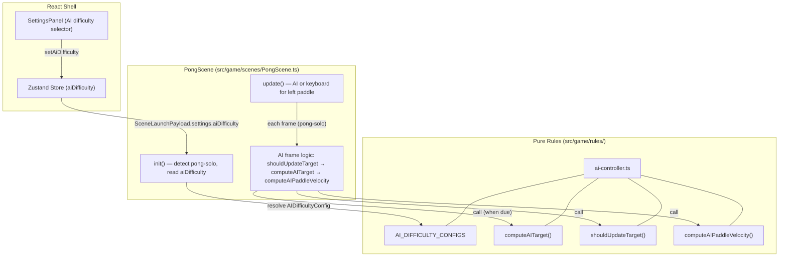

# Design Document — pong-ai

## Overview

This spec adds AI paddle control for `Pong: Solo` mode. The AI controller is a pure TypeScript module that computes target positions and paddle velocities without Phaser dependencies. PongScene conditionally uses the AI controller for the left paddle when the mode is `pong-solo`. The AI behavior model combines three mechanisms — capped paddle speed, reaction delay, and prediction error — to create beatable opponents at three difficulty levels.

### Key Design Decisions

| Decision | Choice | ADR |
|----------|--------|-----|
| AI behavior model | Prediction + delay + speed cap | [ADR-001](decisions/ADR-001-ai-behavior-model.md) |

---

## Architecture



### Ownership Boundaries

| Concern | Owner | Location |
|---------|-------|----------|
| AI difficulty numeric configs | Pure rule | `src/game/rules/ai-controller.ts` |
| AI target computation (prediction + error) | Pure rule | `src/game/rules/ai-controller.ts` |
| AI reaction delay check | Pure rule | `src/game/rules/ai-controller.ts` |
| AI paddle velocity capping | Pure rule | `src/game/rules/ai-controller.ts` |
| AI integration into PongScene update loop | PongScene | `src/game/scenes/PongScene.ts` |
| AI difficulty selection UI | React shell (existing) | `src/components/SettingsPanel.tsx` |
| AI difficulty in store | Zustand store (existing) | `src/app/store.ts` |
| AI difficulty in launch payload | Existing type | `src/game/types/settings.ts` |

---

## Components and Interfaces

### AI Difficulty Configuration

```typescript
// src/game/rules/ai-controller.ts

import type { AIDifficultyPreset } from '../types/modes';

export interface AIDifficultyConfig {
  /** Maximum paddle speed in pixels/second */
  readonly maxPaddleSpeed: number;
  /** Minimum time between target recalculations in milliseconds */
  readonly reactionDelayMs: number;
  /** Maximum random offset applied to predicted intercept in pixels */
  readonly predictionError: number;
}

export const AI_DIFFICULTY_CONFIGS: Record<AIDifficultyPreset, AIDifficultyConfig> = {
  easy: {
    maxPaddleSpeed: 180,
    reactionDelayMs: 500,
    predictionError: 80,
  },
  normal: {
    maxPaddleSpeed: 280,
    reactionDelayMs: 250,
    predictionError: 40,
  },
  hard: {
    maxPaddleSpeed: 370,
    reactionDelayMs: 100,
    predictionError: 15,
  },
};
```

### Ball State Interface

```typescript
// src/game/rules/ai-controller.ts

export interface BallState {
  readonly x: number;
  readonly y: number;
  readonly vx: number;
  readonly vy: number;
}

export interface PlayAreaBounds {
  readonly minY: number;
  readonly maxY: number;
}
```

### AI Target Computation

```typescript
// src/game/rules/ai-controller.ts

/**
 * Computes the AI's target Y position based on ball trajectory prediction.
 *
 * When the ball moves toward the AI paddle (vx < 0), predicts where the ball
 * will intercept the paddle's X column, accounting for wall bounces.
 * Adds a random error offset within [-predictionError, +predictionError].
 * Clamps result to play area bounds.
 *
 * When the ball moves away (vx >= 0), returns the center of the play area.
 *
 * @param ball - Current ball position and velocity
 * @param bounds - Vertical play area boundaries
 * @param paddleX - X position of the AI paddle
 * @param config - Difficulty configuration
 * @param randomSeed - A value in [-1, 1] used to compute the error offset
 *                     (allows deterministic testing)
 */
export function computeAITarget(
  ball: BallState,
  bounds: PlayAreaBounds,
  paddleX: number,
  config: AIDifficultyConfig,
  randomSeed: number,
): number;
```

### Reaction Delay Check

```typescript
// src/game/rules/ai-controller.ts

/**
 * Determines whether the AI should recalculate its target.
 * Returns true when enough time has elapsed since the last update.
 */
export function shouldUpdateTarget(
  elapsedSinceLastUpdate: number,
  config: AIDifficultyConfig,
): boolean;
```

### AI Paddle Velocity

```typescript
// src/game/rules/ai-controller.ts

export interface AIVelocityResult {
  readonly velocity: number;
}

/**
 * Computes the AI paddle's vertical velocity toward its target.
 * Velocity magnitude is capped at maxPaddleSpeed.
 * Returns 0 when within a dead zone threshold of the target.
 *
 * @param currentY - Current paddle center Y
 * @param targetY - Target Y position
 * @param config - Difficulty configuration
 * @param deadZone - Distance threshold below which velocity is 0 (default: 5)
 */
export function computeAIPaddleVelocity(
  currentY: number,
  targetY: number,
  config: AIDifficultyConfig,
  deadZone?: number,
): number;
```

---

## Data Models

### AI Runtime State (in PongScene)

```typescript
// Managed as private fields in PongScene when mode is pong-solo

interface AIRuntimeState {
  config: AIDifficultyConfig;       // resolved from difficulty preset at init
  targetY: number;                   // current target the AI is moving toward
  timeSinceLastUpdate: number;       // ms since last target recalculation
  lastRandomSeed: number;            // random value for prediction error
}
```

### Difficulty Parameter Rationale

| Parameter | Easy | Normal | Hard | Player |
|-----------|------|--------|------|--------|
| maxPaddleSpeed (px/s) | 180 | 280 | 370 | 400 |
| reactionDelayMs | 500 | 250 | 100 | 0 (instant) |
| predictionError (px) | 80 | 40 | 15 | 0 (perfect) |

Design rationale:
- **Easy**: AI moves at 45% of player speed, reacts every 500ms, and aims ±80px off. Very beatable.
- **Normal**: AI moves at 70% of player speed, reacts every 250ms, and aims ±40px off. Moderate challenge.
- **Hard**: AI moves at 92.5% of player speed, reacts every 100ms, and aims ±15px off. Challenging but beatable because the combined error and delay still cause misses, especially on fast rallies.

---

## Ball Intercept Prediction Algorithm

The `computeAITarget` function predicts where the ball will reach the AI paddle's X column:

1. If `ball.vx >= 0` (ball moving away), return center Y of play area.
2. Calculate time to reach paddle X: `t = (paddleX - ball.x) / ball.vx` (note: vx is negative, paddleX < ball.x, so t > 0).
3. Predict raw Y at intercept: `predictedY = ball.y + ball.vy * t`.
4. Simulate wall bounces: reflect `predictedY` within `[bounds.minY, bounds.maxY]` using a fold/reflect algorithm.
5. Apply prediction error: `finalY = predictedY + randomSeed * config.predictionError`.
6. Clamp to bounds: `clamp(finalY, bounds.minY, bounds.maxY)`.

### Wall Bounce Reflection (Fold Algorithm)

```typescript
function reflectY(y: number, minY: number, maxY: number): number {
  const range = maxY - minY;
  // Normalize y into the range
  let normalized = y - minY;
  // Fold into [0, range]
  const periods = Math.floor(normalized / range);
  normalized = normalized - periods * range;
  if (periods % 2 !== 0) {
    normalized = range - normalized;
  }
  return minY + normalized;
}
```

This handles any number of wall bounces without iterative simulation.

---

## PongScene Integration

### Mode Detection

In `init(data)`:
```typescript
if (data?.settings && data.settings.mode === 'pong-solo') {
  this.isAIControlled = true;
  const preset = (data.settings as PongSoloSettings).aiDifficulty;
  this.aiState = {
    config: AI_DIFFICULTY_CONFIGS[preset],
    targetY: PONG.GAME_HEIGHT / 2,
    timeSinceLastUpdate: 0,
    lastRandomSeed: 0,
  };
} else {
  this.isAIControlled = false;
  this.aiState = null;
}
```

### Update Loop Changes

In `update(time, delta)`, the left paddle section becomes:

```typescript
if (this.isAIControlled && this.aiState) {
  // AI controls left paddle
  this.aiState.timeSinceLastUpdate += delta;

  if (shouldUpdateTarget(this.aiState.timeSinceLastUpdate, this.aiState.config)) {
    this.aiState.lastRandomSeed = Phaser.Math.FloatBetween(-1, 1);
    this.aiState.targetY = computeAITarget(
      {
        x: this.ball.x,
        y: this.ball.y,
        vx: this.ball.body.velocity.x,
        vy: this.ball.body.velocity.y,
      },
      { minY: PONG.WALL_THICKNESS, maxY: PONG.GAME_HEIGHT - PONG.WALL_THICKNESS },
      PONG.PADDLE_OFFSET_X,
      this.aiState.config,
      this.aiState.lastRandomSeed,
    );
    this.aiState.timeSinceLastUpdate = 0;
  }

  const aiVelocity = computeAIPaddleVelocity(
    this.leftPaddle.y,
    this.aiState.targetY,
    this.aiState.config,
  );
  this.leftPaddle.body.setVelocityY(aiVelocity);
} else {
  // Keyboard controls left paddle (existing code)
  if (this.keys.w.isDown) {
    this.leftPaddle.body.setVelocityY(-PONG.PADDLE_SPEED);
  } else if (this.keys.s.isDown) {
    this.leftPaddle.body.setVelocityY(PONG.PADDLE_SPEED);
  } else {
    this.leftPaddle.body.setVelocityY(0);
  }
}
```

### Existing Behavior Preserved

- Right paddle input (ArrowUp/ArrowDown) is unchanged.
- Paddle clamping applies to both AI and keyboard-controlled paddles.
- Scoring, win detection, serve mechanics, pause, and audio are unchanged.
- `pong-versus` mode is completely unaffected.

---

## Error Handling

| Scenario | Behavior |
|----------|----------|
| Missing aiDifficulty in pong-solo payload | Default to `'normal'` preset |
| Invalid difficulty string | Fall back to `'normal'` preset |
| Ball velocity is zero (serve pending) | `computeAITarget` returns center Y (ball not moving toward AI) |
| Prediction results in NaN (division edge case) | Clamp to center Y |
| AI target outside bounds | Clamped by `computeAITarget` before return |

---

## Testing Strategy

### Test Approach

The AI controller is a pure module — fully testable in Vitest without Phaser. PongScene integration is verified by manual play.

### Test File Locations

| File | Tests |
|------|-------|
| `src/game/rules/ai-controller.test.ts` | Unit tests for all exported functions |
| `src/game/rules/ai-controller.test.ts` | Property-based tests for invariants |

### Unit Tests

1. `AI_DIFFICULTY_CONFIGS` has entries for all three presets with valid numeric values.
2. `computeAITarget` returns center Y when ball moves away from AI.
3. `computeAITarget` returns a value within bounds for ball moving toward AI.
4. `computeAITarget` accounts for wall bounces (test with steep angles).
5. `shouldUpdateTarget` returns false before delay elapses.
6. `shouldUpdateTarget` returns true after delay elapses.
7. `computeAIPaddleVelocity` returns 0 within dead zone.
8. `computeAIPaddleVelocity` returns positive velocity when target is below.
9. `computeAIPaddleVelocity` returns negative velocity when target is above.
10. `computeAIPaddleVelocity` caps velocity at maxPaddleSpeed.

### Property-Based Tests

| Property | Function | Invariant |
|----------|----------|-----------|
| Target within bounds | `computeAITarget` | For all valid BallState and bounds, returned Target_Y is within [bounds.minY, bounds.maxY] |
| Speed cap respected | `computeAIPaddleVelocity` | For all currentY, targetY, and config, abs(velocity) ≤ config.maxPaddleSpeed |
| Prediction error bounded | `computeAITarget` | For all inputs, the offset from the true intercept is within [-predictionError, +predictionError] |
| Reaction delay monotonic | `shouldUpdateTarget` | If shouldUpdateTarget(t, config) is true, then shouldUpdateTarget(t + dt, config) is also true for dt ≥ 0 |

### Test Tags

```
Feature: pong-ai, Property 1: AI target Y is always within play area bounds
Feature: pong-ai, Property 2: AI paddle velocity never exceeds difficulty speed cap
Feature: pong-ai, Property 3: AI prediction error is bounded by difficulty config
Feature: pong-ai, Property 4: shouldUpdateTarget is monotonically true once delay elapses
```

### What Is NOT Tested

- Full PongScene with AI running (no browser test layer in v1)
- Visual appearance of AI paddle movement (manual QA)
- Game feel / difficulty balance (manual playtesting)
- AI interaction with powerups (deferred to `powerups` spec)

---

## Dependencies

| Dependency | Source | Purpose |
|------------|--------|---------|
| `AIDifficultyPreset` | `src/game/types/modes.ts` | Type for difficulty selection |
| `PongSoloSettings` | `src/game/types/settings.ts` | Payload type with aiDifficulty field |
| `PongScene` | `src/game/scenes/PongScene.ts` | Integration target |
| `clampPaddleY` | `src/game/rules/paddle-physics.ts` | Paddle bounds clamping (reused) |
| `Phaser.Math.FloatBetween` | Phaser 3 | Random seed generation in scene |
| Zustand store | `src/app/store.ts` | AI difficulty state (existing) |
| SettingsPanel | `src/components/SettingsPanel.tsx` | AI difficulty selector (existing) |

No new npm dependencies required.
