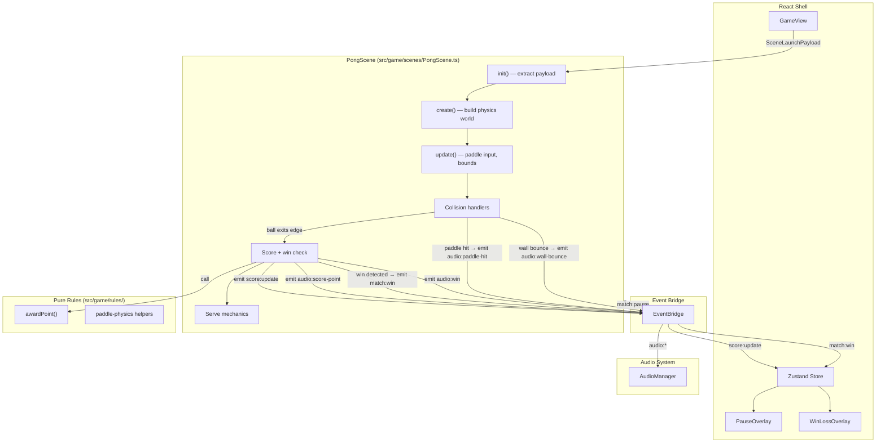

# Design Document — pong-core

## Overview

This spec implements `PongScene`, the first playable Phaser scene in the paddle arcade. It creates a complete Pong: Versus match using Arcade Physics — ball, two paddles, walls, scoring, win detection, and event integration with the React shell. The scene delegates scoring logic to existing pure rules, emits typed events via EventBridge, and triggers audio cues for all gameplay moments.

### Key Design Decisions

| Decision | Choice | ADR |
|----------|--------|-----|
| Ball speed increase formula | Capped linear increment | [ADR-001](decisions/ADR-001-ball-speed-formula.md) |

---

## Architecture



### Ownership Boundaries

| Concern | Owner | Location |
|---------|-------|----------|
| Ball/paddle/wall creation & physics | PongScene | `src/game/scenes/PongScene.ts` |
| Keyboard input processing | PongScene | `src/game/scenes/PongScene.ts` |
| Collision detection & response | PongScene (Phaser Arcade) | `src/game/scenes/PongScene.ts` |
| Point award & serve direction | Pure rule | `src/game/rules/scoring.ts` |
| Paddle bounds clamping (pure helper) | Pure rule | `src/game/rules/paddle-physics.ts` |
| Event emission to React | PongScene via EventBridge | `src/game/systems/EventBridge.ts` |
| Pause listener | PongScene subscribes | `src/game/systems/EventBridge.ts` |
| Audio playback | AudioManager (passive) | `src/game/systems/AudioManager.ts` |
| Score display, overlays | React shell (existing) | `src/components/` |

---

## Components and Interfaces

### PongScene Class

```typescript
// src/game/scenes/PongScene.ts

import Phaser from 'phaser';
import eventBridge from '../systems/EventBridge';
import { awardPoint, type PongScores, type ScoreResult } from '../rules/scoring';
import type { SceneLaunchPayload } from '../types/payload';
import { clampPaddleY } from '../rules/paddle-physics';

export default class PongScene extends Phaser.Scene {
  // Physics bodies
  private ball!: Phaser.Physics.Arcade.Sprite;
  private leftPaddle!: Phaser.Physics.Arcade.Sprite;
  private rightPaddle!: Phaser.Physics.Arcade.Sprite;
  private topWall!: Phaser.Physics.Arcade.Sprite;
  private bottomWall!: Phaser.Physics.Arcade.Sprite;

  // Input
  private keys!: {
    w: Phaser.Input.Keyboard.Key;
    s: Phaser.Input.Keyboard.Key;
    up: Phaser.Input.Keyboard.Key;
    down: Phaser.Input.Keyboard.Key;
  };

  // Match state
  private scores: PongScores;
  private winScore: number;
  private serveDirection: 'left' | 'right';
  private matchOver: boolean;
  private paused: boolean;

  // Ball speed
  private readonly BASE_SPEED: number;
  private readonly SPEED_INCREMENT: number;
  private readonly MAX_SPEED: number;
  private currentSpeed: number;

  constructor();
  init(data?: SceneLaunchPayload): void;
  create(): void;
  update(): void;
  shutdown(): void;
}
```

### Paddle Physics Helper (Pure Module)

```typescript
// src/game/rules/paddle-physics.ts

export interface PaddleBounds {
  readonly minY: number;
  readonly maxY: number;
}

export interface PaddleConfig {
  readonly height: number;
  readonly speed: number;
}

/**
 * Clamps a paddle's Y position to stay within vertical bounds.
 * Returns the clamped Y value.
 */
export function clampPaddleY(
  currentY: number,
  paddleHeight: number,
  bounds: PaddleBounds
): number;

/**
 * Computes the next paddle Y position given input direction and delta time.
 * Direction: -1 (up), 0 (none), +1 (down).
 * Result is clamped to bounds.
 */
export function computePaddleY(
  currentY: number,
  direction: -1 | 0 | 1,
  config: PaddleConfig,
  bounds: PaddleBounds,
  deltaMs: number
): number;
```

### Ball Speed Helper (Pure Module)

```typescript
// src/game/rules/ball-speed.ts

export interface BallSpeedConfig {
  readonly baseSpeed: number;
  readonly increment: number;
  readonly maxSpeed: number;
}

/**
 * Computes the new ball speed after a paddle hit.
 * Adds increment, caps at maxSpeed.
 */
export function computeSpeedAfterHit(
  currentSpeed: number,
  config: BallSpeedConfig
): number;

/**
 * Returns the base speed (used after scoring a point).
 */
export function getServeSpeed(config: BallSpeedConfig): number;
```

---

## Data Models

### Scene Constants

```typescript
// Defined as readonly properties in PongScene or a constants module

const PONG_CONSTANTS = {
  // Play area (matches Phaser game config)
  GAME_WIDTH: 800,
  GAME_HEIGHT: 600,

  // Paddle dimensions
  PADDLE_WIDTH: 16,
  PADDLE_HEIGHT: 100,
  PADDLE_OFFSET_X: 40,       // distance from edge to paddle center
  PADDLE_SPEED: 400,         // pixels per second

  // Ball
  BALL_RADIUS: 8,

  // Ball speed (pixels per second)
  BASE_SPEED: 300,
  SPEED_INCREMENT: 25,       // added per paddle hit
  MAX_SPEED: 600,            // absolute cap

  // Walls
  WALL_THICKNESS: 16,

  // Serve
  SERVE_DELAY_MS: 500,       // delay between point scored and next serve
} as const;
```

### Match State

```typescript
interface PongMatchState {
  scores: PongScores;          // { left: number, right: number }
  winScore: number;            // locked from payload
  serveDirection: 'left' | 'right';
  matchOver: boolean;
  paused: boolean;
  currentSpeed: number;        // current ball speed magnitude
}
```

---

## Scene Lifecycle

### init(data)

1. Extract `winScore` from `data.settings` (default 7 if missing).
2. Reset `scores` to `{ left: 0, right: 0 }`.
3. Set `matchOver = false`, `paused = false`.
4. Set initial `serveDirection` to `'right'` (first serve goes right).
5. Set `currentSpeed = BASE_SPEED`.

### create()

1. Create top and bottom Wall sprites (immovable static bodies).
2. Create left and right Paddle sprites (immovable bodies with manual velocity control).
3. Create Ball sprite (dynamic body, no gravity, bounce factor 1).
4. Set up colliders: Ball ↔ Walls, Ball ↔ Paddles.
5. Register collision callbacks for audio and speed increase.
6. Register keyboard keys (W, S, ArrowUp, ArrowDown).
7. Subscribe to `match:pause` on EventBridge.
8. Perform initial serve.

### update(time, delta)

1. If `matchOver` or `paused`, return early.
2. Read keyboard state, compute paddle velocities.
3. Clamp paddle positions to bounds.
4. Check if Ball has exited left or right edge (world bounds check).
5. If Ball exited: call `awardPoint`, emit events, check win, serve or end match.

### shutdown()

1. Unsubscribe `match:pause` handler from EventBridge.
2. Destroy all physics bodies.
3. Clear keyboard references.

---

## Collision Handling

### Ball ↔ Paddle

Handled by Phaser Arcade Physics collider with a callback:

1. Emit `audio:paddle-hit` via EventBridge.
2. Increase `currentSpeed` by `SPEED_INCREMENT` (capped at `MAX_SPEED`).
3. Phaser Arcade handles velocity reflection automatically via `setBounce(1, 1)` on the ball and `setImmovable(true)` on paddles.
4. After collision, normalize ball velocity vector and scale to `currentSpeed` to maintain consistent speed magnitude.

### Ball ↔ Wall

Handled by Phaser Arcade Physics collider with a callback:

1. Emit `audio:wall-bounce` via EventBridge.
2. Phaser Arcade handles velocity reflection automatically.

### Ball Exits Play Area

Detected in `update()` by checking ball X position against world bounds:

1. Determine exit edge (`'left'` or `'right'`).
2. Call `awardPoint(scores, exitEdge)` → get `ScoreResult`.
3. Update `scores` and `serveDirection` from result.
4. Emit `score:update` with new scores.
5. Emit `audio:score-point`.
6. Check if either score equals `winScore` → if yes, trigger win flow.
7. If no win, schedule next serve after `SERVE_DELAY_MS`.

---

## Serve Flow

1. Position Ball at center (400, 300).
2. Reset `currentSpeed` to `BASE_SPEED`.
3. Compute velocity vector: horizontal component = `serveDirection === 'right' ? 1 : -1`, vertical component = random between -0.5 and 0.5 (normalized).
4. Scale velocity vector to `BASE_SPEED`.
5. Set Ball velocity.

The random vertical component prevents predictable straight serves while keeping the ball moving primarily horizontally.

---

## Pause Integration

### Receiving Pause

```typescript
private handlePause = (payload: { paused: boolean }): void => {
  this.paused = payload.paused;
  if (payload.paused) {
    this.physics.pause();
    eventBridge.emit('audio:pause', undefined);
  } else {
    this.physics.resume();
  }
};
```

- Subscribe in `create()`: `eventBridge.on('match:pause', this.handlePause)`
- Unsubscribe in `shutdown()`: `eventBridge.off('match:pause', this.handlePause)`

### Input During Pause

The `update()` method returns early when `paused === true`, so paddle input is naturally ignored.

---

## Win Flow

1. Set `matchOver = true`.
2. Stop Ball (set velocity to 0).
3. Determine winner: the player whose score reached `winScore`.
4. Emit `match:win` with `{ winner: 'left' | 'right' }`.
5. Emit `audio:win`.
6. Scene remains active but frozen — React shell handles the overlay and restart/menu flow.

---

## Programmatic Rendering

All game objects are drawn programmatically using Phaser's graphics API — no external image assets.

| Object | Rendering |
|--------|-----------|
| Ball | White filled circle, radius 8px |
| Paddles | White filled rectangles, 16×100px |
| Walls | Dark gray filled rectangles, full width × 16px height |
| Background | Scene background color set to dark neutral (#111111) |

Visual polish (glow, particles) is deferred to the `neon-visuals` spec.

---

## Error Handling

| Scenario | Behavior |
|----------|----------|
| Missing SceneLaunchPayload | Use defaults: winScore=7, serveDirection='right' |
| Invalid winScore in payload | Clamp using existing `validateWinScore()` |
| Keyboard keys unavailable | Graceful no-op (Phaser handles missing input plugin) |
| EventBridge emit during shutdown | No-op (EventBridge handles missing listeners) |
| Rapid pause/unpause | Physics pause/resume is idempotent in Phaser |
| Ball stuck (edge case) | Ball world bounds check in update() catches exit regardless of collision state |

---

## Testing Strategy

### Test Approach

PongScene is a Phaser scene — it cannot be unit-tested in Node without a browser. Testing focuses on:

1. **Pure helper modules** — fully testable in Vitest
2. **Property-based tests** — for invariants on pure helpers
3. **Integration** — verified by manual play + existing shell event tests

### Test File Locations

| File | Tests |
|------|-------|
| `src/game/rules/paddle-physics.test.ts` | Paddle bounds clamping, movement computation |
| `src/game/rules/ball-speed.test.ts` | Speed after hit, serve speed, bounds invariant |

### Property-Based Tests

| Property | Module | Invariant |
|----------|--------|-----------|
| Paddle Y stays within bounds | `paddle-physics` | For all input sequences and delta values, `computePaddleY` result is in [minY, maxY] |
| Ball speed stays within bounds | `ball-speed` | For all hit sequences, `computeSpeedAfterHit` result is in [baseSpeed, maxSpeed] |
| Ball speed never decreases on hit | `ball-speed` | `computeSpeedAfterHit(s, config) >= s` for all valid s |

### What Is NOT Tested

- Full Phaser scene rendering (no browser test layer in v1)
- Visual appearance of game objects (manual QA)
- Audio output (tested by audio-system spec)
- React overlay behavior (tested by react-app-shell spec)
- Phaser collision detection accuracy (trust Phaser Arcade)

### Test Tags

```
Feature: pong-core, Property 1: paddle Y stays within bounds for any input sequence
Feature: pong-core, Property 2: ball speed stays within [baseSpeed, maxSpeed] for any hit sequence
Feature: pong-core, Property 3: ball speed never decreases on paddle hit
```

---

## Dependencies

| Dependency | Source | Purpose |
|------------|--------|---------|
| `awardPoint` | `src/game/rules/scoring.ts` | Point award and serve direction |
| `validateWinScore` | `src/game/rules/win-score.ts` | Payload winScore validation |
| `EventBridge` | `src/game/systems/EventBridge.ts` | Event emission and pause subscription |
| `AudioManager` | `src/game/systems/AudioManager.ts` | Passive audio (no direct import needed) |
| `SceneLaunchPayload` | `src/game/types/payload.ts` | Scene initialization contract |
| `PongScores`, `ScoreResult` | `src/game/rules/scoring.ts` | Score state types |
| `EventMap` | `src/game/types/events.ts` | Type-safe event emission |
| Phaser 3 Arcade Physics | npm `phaser` | Physics simulation |

No new npm dependencies required.
