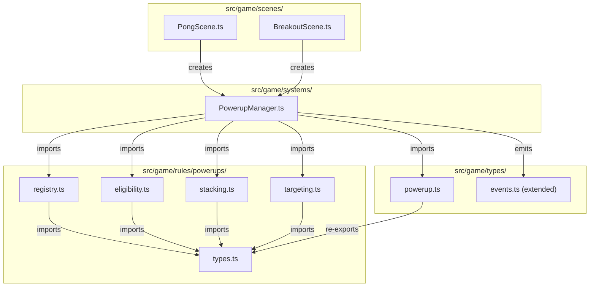

# Design Document — powerups

## Overview

This spec delivers the optional powerup system for all three game modes. The design separates concerns into three layers:

1. **Pure data layer** (`src/game/rules/powerups/`) — powerup definitions, registry, eligibility filtering, stacking policy, and duration logic. Zero Phaser imports, fully unit-testable.
2. **System layer** (`src/game/systems/PowerupManager.ts`) — scene-level orchestration of spawn timing, collection, effect application, duration tracking, and cleanup. Depends on Phaser scene context.
3. **Scene integration** — PongScene and BreakoutScene instantiate the PowerupManager and wire it to physics colliders and match lifecycle events.

### Key Design Decisions

| Decision | Choice | ADR |
|----------|--------|-----|
| Registry as pure data | Static array + lookup functions, no classes | [ADR-001](decisions/ADR-001-pure-registry-pattern.md) |
| Effect application strategy | Multiplier-based with stored original values | [ADR-002](decisions/ADR-002-effect-application-strategy.md) |
| Spawn timing model | Interval + probability, max 1 on screen | [ADR-003](decisions/ADR-003-spawn-timing-model.md) |

---

## Architecture



### Ownership Boundaries

| Concern | Owner | Location |
|---------|-------|----------|
| Powerup type definitions | Shared types | `src/game/types/powerup.ts` |
| Powerup registry & pure logic | Pure rules | `src/game/rules/powerups/` |
| Spawn, collection, effects, cleanup | System | `src/game/systems/PowerupManager.ts` |
| Physics colliders & scene wiring | Scenes | `src/game/scenes/PongScene.ts`, `BreakoutScene.ts` |
| EventBridge audio events | Shared types | `src/game/types/events.ts` |

### Constraints

- **No Phaser imports** in `src/game/rules/powerups/` or `src/game/types/powerup.ts`.
- **No mutation** in pure rule functions — return new state.
- **PowerupManager** is instantiated per scene, not a singleton. Each match gets a fresh instance.
- **Powerups default off** — the system is inert when `powerupsEnabled` is false.

---

## Components and Interfaces

### Type Definitions

#### `src/game/types/powerup.ts`

```typescript
import type { GameMode, PlayerId } from './modes';

/** Stable powerup identifiers */
export type PowerupId =
  | 'ball-speed-up'
  | 'ball-slow-down'
  | 'paddle-grow'
  | 'paddle-shrink'
  | 'multi-ball'
  | 'ai-freeze'
  | 'opponent-paddle-shrink'
  | 'piercing-ball'
  | 'sticky-paddle'
  | 'extra-life'
  | 'wide-paddle';

/** Effect classification */
export type EffectType = 'beneficial' | 'harmful' | 'neutral';

/** A powerup definition — pure data, no behavior */
export interface PowerupDefinition {
  readonly id: PowerupId;
  readonly displayName: string;
  readonly eligibleModes: readonly GameMode[];
  readonly duration: number | null; // ms, null = permanent
  readonly spawnWeight: number;
  readonly effectType: EffectType;
  readonly targetsSelf: boolean;
}

/** An active effect being tracked at runtime */
export interface ActiveEffect {
  readonly powerupId: PowerupId;
  readonly targetPlayer: PlayerId;
  readonly remainingMs: number | null; // null = permanent
  readonly appliedAt: number; // timestamp
}

/** Spawn configuration */
export interface SpawnConfig {
  readonly minInterval: number; // ms between spawn attempts
  readonly maxInterval: number; // ms between spawn attempts
  readonly spawnProbability: number; // 0-1
  readonly maxOnScreen: number;
  readonly despawnTime: number; // ms before uncollected powerup disappears
}
```

#### `src/game/types/events.ts` (extension)

```typescript
// Add to existing EventMap:
'audio:powerup-expire': undefined;
```

### Pure Rule Modules

#### `src/game/rules/powerups/registry.ts`

```typescript
import type { PowerupDefinition, PowerupId } from '../../types/powerup';

/** All 11 powerup definitions */
export const POWERUP_DEFINITIONS: readonly PowerupDefinition[];

/** Look up a powerup by ID. Returns undefined for unknown IDs. */
export function getPowerupById(id: PowerupId): PowerupDefinition;

/** Get all powerup definitions as an array */
export function getAllPowerups(): readonly PowerupDefinition[];
```

#### `src/game/rules/powerups/eligibility.ts`

```typescript
import type { GameMode } from '../../types/modes';
import type { PowerupDefinition } from '../../types/powerup';

/** Filter powerups to those eligible for the given mode */
export function getEligiblePowerups(mode: GameMode): readonly PowerupDefinition[];

/** Check if a specific powerup is eligible for a mode */
export function isPowerupEligible(powerupId: PowerupId, mode: GameMode): boolean;
```

#### `src/game/rules/powerups/stacking.ts`

```typescript
import type { ActiveEffect, PowerupId } from '../../types/powerup';
import type { PlayerId } from '../../types/modes';

/** Result of applying stacking policy */
export interface StackingResult {
  readonly action: 'apply-new' | 'refresh-duration';
  readonly effects: readonly ActiveEffect[];
}

/**
 * Applies stacking policy: if the same powerup is already active on the same target,
 * refresh duration. Otherwise, add as new effect.
 */
export function applyStackingPolicy(
  activeEffects: readonly ActiveEffect[],
  powerupId: PowerupId,
  targetPlayer: PlayerId,
  duration: number | null,
  timestamp: number
): StackingResult;
```

#### `src/game/rules/powerups/targeting.ts`

```typescript
import type { PowerupDefinition } from '../../types/powerup';
import type { PlayerId, GameMode } from '../../types/modes';

/**
 * Determines which player a powerup effect targets.
 * - Beneficial/neutral: targets the collector
 * - Harmful in Pong: targets the opponent
 * - Harmful in Breakout: targets the collector (no opponent)
 */
export function resolveTarget(
  definition: PowerupDefinition,
  collector: PlayerId,
  mode: GameMode
): PlayerId;
```

### System Module

#### `src/game/systems/PowerupManager.ts`

```typescript
import Phaser from 'phaser';
import type { GameMode, PlayerId } from '../types/modes';
import type { PowerupId, SpawnConfig } from '../types/powerup';

export const DEFAULT_SPAWN_CONFIG: SpawnConfig = {
  minInterval: 8000,
  maxInterval: 15000,
  spawnProbability: 0.4,
  maxOnScreen: 1,
  despawnTime: 8000,
};

/**
 * Manages powerup spawning, collection, effect application, and cleanup.
 * Instantiated per scene — not a singleton.
 */
export class PowerupManager {
  constructor(scene: Phaser.Scene, mode: GameMode, config?: Partial<SpawnConfig>);

  /** Start the spawn loop. Call in scene create() when powerupsEnabled is true. */
  start(): void;

  /** Pause all timers (spawn + active effects). Call on match pause. */
  pause(): void;

  /** Resume all timers. Call on match resume. */
  resume(): void;

  /** Handle powerup collection. Called from physics collider callback. */
  collect(powerupId: PowerupId, collector: PlayerId): void;

  /** Clean up all effects, timers, and sprites. Call on match end/restart/shutdown. */
  destroy(): void;

  /** Get currently active effects (for testing/debugging) */
  getActiveEffects(): readonly ActiveEffect[];
}
```

### Scene Integration Pattern

Both PongScene and BreakoutScene follow this pattern:

```typescript
// In create():
if (this.settings.powerupsEnabled) {
  this.powerupManager = new PowerupManager(this, this.mode);
  this.powerupManager.start();
}

// In pause handler:
this.powerupManager?.pause();

// In resume handler:
this.powerupManager?.resume();

// In handleRestart / shutdown:
this.powerupManager?.destroy();
this.powerupManager = undefined;
```

---

## Data Models

### Powerup Definitions (Static Data)

| ID | Display Name | Modes | Duration | Weight | Effect | Targets Self |
|----|-------------|-------|----------|--------|--------|-------------|
| `ball-speed-up` | Ball Speed Up | all | 6000ms | 10 | neutral | true |
| `ball-slow-down` | Ball Slow Down | all | 6000ms | 10 | beneficial | true |
| `paddle-grow` | Paddle Grow | all | 8000ms | 8 | beneficial | true |
| `paddle-shrink` | Paddle Shrink | all | 8000ms | 8 | harmful | false |
| `multi-ball` | Multi Ball | all | 10000ms | 5 | beneficial | true |
| `ai-freeze` | AI Freeze | pong-solo | 4000ms | 4 | harmful | false |
| `opponent-paddle-shrink` | Opponent Shrink | pong-solo, pong-versus | 8000ms | 6 | harmful | false |
| `piercing-ball` | Piercing Ball | breakout | 6000ms | 7 | beneficial | true |
| `sticky-paddle` | Sticky Paddle | breakout | 10000ms | 6 | beneficial | true |
| `extra-life` | Extra Life | breakout | null | 3 | beneficial | true |
| `wide-paddle` | Wide Paddle | breakout | 8000ms | 7 | beneficial | true |

### Effect Multipliers (Constants)

```typescript
export const EFFECT_MULTIPLIERS = {
  ballSpeedUp: 1.3,
  ballSlowDown: 0.7,
  paddleGrow: 1.5,
  paddleShrink: 0.7,
  opponentPaddleShrink: 0.7,
  widePaddle: 1.5,
} as const;
```

### Spawn Configuration (Defaults)

```typescript
export const DEFAULT_SPAWN_CONFIG: SpawnConfig = {
  minInterval: 8000,   // 8 seconds minimum between spawn attempts
  maxInterval: 15000,  // 15 seconds maximum between spawn attempts
  spawnProbability: 0.4, // 40% chance per attempt
  maxOnScreen: 1,      // only 1 uncollected powerup at a time
  despawnTime: 8000,   // disappears after 8 seconds if not collected
};
```

---

## Correctness Properties

### Property 1: Eligibility filter returns only mode-valid powerups

*For any* GameMode, calling `getEligiblePowerups(mode)` SHALL return only PowerupDefinitions whose `eligibleModes` array includes that mode.

**Validates: Requirements 3.5, 3.1**

### Property 2: Registry lookup is total for known IDs

*For any* PowerupId value, calling `getPowerupById(id)` SHALL return a PowerupDefinition with `definition.id === id`.

**Validates: Requirements 2.5, 2.2**

### Property 3: Stacking policy never duplicates active effects

*For any* sequence of `applyStackingPolicy` calls with the same powerupId and targetPlayer, the resulting `effects` array SHALL contain at most one entry for that (powerupId, targetPlayer) pair.

**Validates: Requirements 8.1, 8.2, 8.4**

### Property 4: Stacking refresh resets to full duration

*For any* active effect that is refreshed via `applyStackingPolicy`, the resulting effect's `remainingMs` SHALL equal the powerup's configured `duration`, not the sum of old remaining + new duration.

**Validates: Requirements 8.4, 8.1**

### Property 5: Target resolution for harmful powerups in Pong

*For any* PowerupDefinition with `targetsSelf === false` and `effectType === 'harmful'`, and any Pong mode (`pong-solo` or `pong-versus`), calling `resolveTarget` SHALL return a PlayerId different from the collector.

**Validates: Requirements 9.1, 9.2, 9.4**

### Property 6: Target resolution for beneficial powerups

*For any* PowerupDefinition with `targetsSelf === true`, calling `resolveTarget` SHALL return the collector's PlayerId regardless of mode.

**Validates: Requirements 9.3**

### Property 7: Eligible powerup count per mode

*For* mode `pong-solo`, `getEligiblePowerups` SHALL return exactly 7 powerups (5 shared + AI Freeze + Opponent Shrink). *For* mode `pong-versus`, SHALL return exactly 6 (5 shared + Opponent Shrink). *For* mode `breakout`, SHALL return exactly 9 (5 shared + Piercing Ball + Sticky Paddle + Extra Life + Wide Paddle).

**Validates: Requirements 3.2, 3.3, 3.4**

### Property 8: Pure rule functions do not mutate inputs

*For any* input to `getEligiblePowerups`, `applyStackingPolicy`, or `resolveTarget`, calling the function SHALL not modify the input (deep-equality check before and after).

**Validates: Requirements 2.4 (pure module constraint)**

---

## Error Handling

| Scenario | Behavior |
|----------|----------|
| Unknown PowerupId passed to `getPowerupById` | Returns `undefined` — caller must handle |
| `collect()` called with powerup not eligible for mode | No-op, effect not applied (defensive) |
| `collect()` called when manager is paused | No-op (powerup sprite shouldn't be collidable while paused) |
| `destroy()` called multiple times | Idempotent — second call is a no-op |
| Spawn attempt when max on screen reached | Spawn skipped, timer resets for next attempt |
| Effect expiry after match already ended | No-op — destroy() already cleaned up |

### Design Rationale

- **No exceptions for gameplay edge cases**: Powerup collection during edge states (pause, match end) is handled defensively with no-ops rather than thrown errors. This prevents runtime crashes from race conditions between physics callbacks and state transitions.
- **Idempotent destroy**: Scenes may call destroy() from multiple paths (restart, shutdown, match end). Making it idempotent avoids double-free bugs.
- **Undefined return for unknown IDs**: The registry lookup returns undefined rather than throwing because TypeScript's type system already constrains valid IDs at compile time. Runtime unknown IDs indicate a programming error, not a user input error.

---

## Testing Strategy

### Dual Testing Approach

| Test Type | What It Covers |
|-----------|---------------|
| **Property tests (fast-check)** | All 8 correctness properties — universal invariants across random inputs |
| **Unit tests (Vitest)** | Specific powerup definitions, edge cases, integration behavior |

### Property-Based Test Configuration

- **Library:** `fast-check`
- **Minimum iterations:** 100 per property test
- **Tag format:** `Feature: powerups, Property N: <property_text>`

### Test File Locations

| File | Tests |
|------|-------|
| `src/game/rules/powerups/registry.test.ts` | Property 2 (lookup total), unit tests for all 11 definitions |
| `src/game/rules/powerups/eligibility.test.ts` | Property 1 (mode-valid), Property 7 (counts), unit tests per mode |
| `src/game/rules/powerups/stacking.test.ts` | Property 3 (no duplicates), Property 4 (refresh duration), unit tests |
| `src/game/rules/powerups/targeting.test.ts` | Property 5 (harmful targeting), Property 6 (beneficial targeting), unit tests |
| `src/game/rules/powerups/no-mutation.test.ts` | Property 8 (input immutability) |

### What Is NOT Tested with Property-Based Tests

- Spawn timing (depends on Phaser clock — use unit tests with mocked timers)
- Physics collisions (Phaser runtime — manual play-test)
- Visual rendering (particle effects, sprite appearance — manual play-test)
- Audio playback (EventBridge emission is tested, actual sound is not)

### Manual Verification Checklist

- [ ] Pong Solo: powerup spawns, ball collects it, effect applies to correct target
- [ ] Pong Solo: AI Freeze stops AI movement for duration
- [ ] Pong Versus: harmful powerup targets opponent
- [ ] Breakout: Extra Life increments lives display
- [ ] Breakout: Piercing Ball passes through bricks
- [ ] All modes: powerup despawns after timeout if not collected
- [ ] All modes: effects revert on match restart
- [ ] All modes: no powerups spawn when `powerupsEnabled` is false
- [ ] All modes: pause freezes effect timers, resume continues them

---

## Dependencies

- `shared-types-and-rules` — GameMode, PlayerId, MatchSettings types
- `pong-core` — PongScene for integration
- `pong-ai` — AI controller for AI Freeze effect
- `breakout-core` — BreakoutScene for integration
- `match-lifecycle` — pause/resume/restart hooks
- `audio-system` — EventBridge audio events
