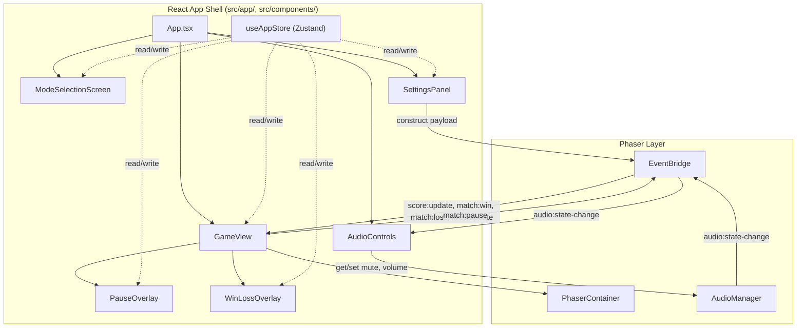

# Design Document — react-app-shell

## Overview

This spec delivers the React app shell that wraps the Phaser game: mode selection, pre-match settings, pause/win/loss overlays, audio controls, and Phaser lifecycle management. Zustand provides global state without prop drilling. The EventBridge carries scene events to React and launch commands to Phaser. All UI follows the neon arcade visual direction and is fully keyboard-navigable.

### Key Design Decisions

| Decision | Choice | ADR |
|----------|--------|-----|
| State management | Zustand (lightweight global store) | [ADR-001](decisions/ADR-001-zustand-vs-react-state.md) |

---

## Architecture



### Ownership Boundaries

| Concern | Owner | Location |
|---------|-------|----------|
| App phase routing | React (App.tsx) | `src/app/App.tsx` |
| Mode selection UI | React component | `src/components/ModeSelectionScreen.tsx` |
| Settings UI | React component | `src/components/SettingsPanel.tsx` |
| Game view + overlays | React component | `src/components/GameView.tsx` |
| Pause overlay | React component | `src/components/PauseOverlay.tsx` |
| Win/loss overlay | React component | `src/components/WinLossOverlay.tsx` |
| Audio controls | React component | `src/components/AudioControls.tsx` |
| Global app state | Zustand store | `src/app/store.ts` |
| Phaser mount/unmount | React (PhaserContainer) | `src/components/PhaserContainer.tsx` (existing) |
| Scene event transport | EventBridge | `src/game/systems/EventBridge.ts` (existing) |
| Audio state | AudioManager | `src/game/systems/AudioManager.ts` (existing) |
| Settings validation | Pure rules | `src/game/rules/settings-validator.ts` (existing) |
| Neon arcade CSS | Stylesheet | `src/app/styles.css` |

### Integration Pattern

React drives the app lifecycle. Phaser is mounted only during the "playing" phase. Communication flows through the EventBridge:

1. **React → Phaser**: App shell constructs `SceneLaunchPayload`, passes via Phaser game config `data` field or emits a launch event.
2. **Phaser → React**: Scenes emit `score:update`, `match:win`, `match:loss`, `match:pause`, `lives:update` on the EventBridge. The `GameView` component subscribes and updates the Zustand store.
3. **React → AudioManager**: Audio controls call `AudioManager.setMuted()` / `AudioManager.setVolume()` directly (AudioManager is a singleton module import).
4. **AudioManager → React**: AudioManager emits `audio:state-change` on EventBridge. AudioControls subscribes for re-render.

### App Phase State Machine

```
┌──────┐   select mode   ┌──────────┐   start match   ┌─────────┐
│ menu │ ───────────────► │ settings │ ───────────────► │ playing │
└──────┘                  └──────────┘                  └─────────┘
    ▲                          │                             │
    │         back             │                             │
    │◄─────────────────────────┘                             │
    │                                                        │
    │              return to menu                             │
    │◄───────────────────────────────────────────────────────┘
```

States:
- **menu**: Mode selection screen visible. No Phaser game mounted.
- **settings**: Settings panel visible for the selected mode. No Phaser game mounted.
- **playing**: Phaser game mounted and running. Overlays may appear on top.

---

## Components and Interfaces

### Zustand Store (`src/app/store.ts`)

```typescript
import type { GameMode } from '../game/types/modes';
import type { MatchSettings } from '../game/types/settings';
import type { PlayerId } from '../game/types/modes';

export type AppPhase = 'menu' | 'settings' | 'playing';

export interface MatchData {
  readonly scores: { left: number; right: number };
  readonly lives: number;
  readonly winner: PlayerId | null;
  readonly finalScore: number | null;
}

export interface AppState {
  // Phase
  phase: AppPhase;

  // Mode & Settings
  selectedMode: GameMode | null;
  winScore: number;
  aiDifficulty: 'easy' | 'normal' | 'hard';
  powerupsEnabled: boolean;

  // Overlays
  pauseOverlayOpen: boolean;
  winLossOverlayOpen: boolean;

  // Match data (updated by scene events)
  matchData: MatchData;

  // Actions
  selectMode: (mode: GameMode) => void;
  goToMenu: () => void;
  goToSettings: () => void;
  startMatch: () => void;
  setWinScore: (score: number) => void;
  setAiDifficulty: (difficulty: 'easy' | 'normal' | 'hard') => void;
  setPowerupsEnabled: (enabled: boolean) => void;
  openPauseOverlay: () => void;
  closePauseOverlay: () => void;
  openWinLossOverlay: (winner: PlayerId | null, finalScore: number | null) => void;
  closeWinLossOverlay: () => void;
  updateScores: (left: number, right: number) => void;
  updateLives: (remaining: number) => void;
  resetMatchData: () => void;
}
```

**Design notes:**
- Settings fields (`winScore`, `aiDifficulty`, `powerupsEnabled`) live at the top level for direct binding to UI controls.
- `matchData` is a nested object updated by EventBridge listeners during gameplay.
- `resetMatchData` is called on match start and return-to-menu to clear stale state.
- The store is created with `create` from Zustand — no middleware needed for v1.

### App Component (`src/app/App.tsx`)

```typescript
function App(): React.JSX.Element {
  const phase = useAppStore((s) => s.phase);

  return (
    <div className="app-shell">
      <AudioControls />
      {phase === 'menu' && <ModeSelectionScreen />}
      {phase === 'settings' && <SettingsPanel />}
      {phase === 'playing' && <GameView />}
    </div>
  );
}
```

Conditional rendering based on `phase`. AudioControls is always visible.

### ModeSelectionScreen (`src/components/ModeSelectionScreen.tsx`)

- Renders three mode buttons in a segmented/card layout
- Each button calls `selectMode(mode)` which sets the mode and transitions to settings phase
- Keyboard: Tab between buttons, Enter to select
- Visual: neon-bordered cards with mode names, focus glow on active

### SettingsPanel (`src/components/SettingsPanel.tsx`)

- Reads `selectedMode` from store to determine which controls to show
- Win score: number input or stepper, constrained 3–21, default 7
- AI difficulty: segmented control with Easy/Normal/Hard, default Normal
- Powerups: toggle/checkbox, default off (disabled label: "Coming soon")
- Start button: validates via `validateSettings()`, constructs payload, calls `startMatch()`
- Back button: calls `goToMenu()`
- Keyboard: Tab between controls, Enter on buttons

### GameView (`src/components/GameView.tsx`)

- Mounts `PhaserContainer` with game config including the scene and launch payload
- Subscribes to EventBridge events in a `useEffect`:
  - `score:update` → `updateScores()`
  - `match:win` → `openWinLossOverlay(winner, null)`
  - `match:loss` → `openWinLossOverlay(null, finalScore)`
  - `lives:update` → `updateLives()`
  - `match:pause` → sync pause state
- Listens for Escape keydown → `openPauseOverlay()` + emit `match:pause { paused: true }`
- Renders `PauseOverlay` and `WinLossOverlay` conditionally based on store state
- Cleans up all EventBridge subscriptions on unmount

### PauseOverlay (`src/components/PauseOverlay.tsx`)

- Renders when `pauseOverlayOpen === true`
- Three buttons: Resume, Restart, Return to Menu
- Resume: `closePauseOverlay()` + emit `match:pause { paused: false }`
- Restart: `resetMatchData()` + restart scene + `closePauseOverlay()`
- Return to Menu: `goToMenu()` (triggers Phaser unmount via phase change)
- Focus trap: Tab cycles within overlay buttons
- Escape key: equivalent to Resume

### WinLossOverlay (`src/components/WinLossOverlay.tsx`)

- Renders when `winLossOverlayOpen === true`
- Displays outcome: "Player X Wins!" for Pong, "Game Over — Score: N" for Breakout
- Two buttons: Restart, Return to Menu
- Restart: `resetMatchData()` + restart scene + `closeWinLossOverlay()`
- Return to Menu: `goToMenu()`
- Focus trap: Tab cycles within overlay buttons

### AudioControls (`src/components/AudioControls.tsx`)

- Imports AudioManager singleton directly for get/set operations
- Subscribes to `audio:state-change` on EventBridge for reactive updates
- Mute toggle: button with speaker icon (muted/unmuted state)
- Volume: range input or slider [0, 1] with 0.1 step
- Keyboard: Tab to focus, Enter/Space for mute toggle, arrow keys for volume slider
- Unsubscribes from EventBridge on unmount

### Neon Arcade Styles (`src/app/styles.css`)

```css
/* Key design tokens */
:root {
  --bg-primary: #0a0a0f;
  --bg-surface: #14141f;
  --text-primary: #e8e8f0;
  --text-secondary: #8888aa;
  --accent-neon: #00ffcc;
  --accent-glow: 0 0 8px rgba(0, 255, 204, 0.4);
  --border-color: #2a2a3f;
  --border-radius: 4px;
  --focus-ring: 0 0 0 2px var(--accent-neon);
}
```

- Dark background (`--bg-primary`) for all screens
- High-contrast text (`--text-primary`)
- Neon accent for focus states and active elements
- Crisp borders with subtle radius
- No gradients, no hero images, no decorative blobs
- Focus indicators use `--focus-ring` box-shadow

---

## Data Models

### App Phase

```typescript
type AppPhase = 'menu' | 'settings' | 'playing';
```

Simple string union. Drives conditional rendering in App.tsx.

### Match Data

```typescript
interface MatchData {
  readonly scores: { left: number; right: number };
  readonly lives: number;
  readonly winner: PlayerId | null;
  readonly finalScore: number | null;
}
```

Default: `{ scores: { left: 0, right: 0 }, lives: 3, winner: null, finalScore: null }`

Reset on match start and return-to-menu.

### Scene Launch Payload Construction

```typescript
function buildLaunchPayload(state: AppState): SceneLaunchPayload {
  const settings = buildMatchSettings(state);
  const players = getPlayersForMode(state.selectedMode);
  return { settings, players };
}
```

Player assignments:
- `pong-solo`: `['left', 'right']` (left = AI, right = player)
- `pong-versus`: `['left', 'right']`
- `breakout`: `['solo']`

---

## Correctness Properties

### Property 1: Settings panel shows mode-appropriate controls

*For any* valid `GameMode` value, selecting that mode and rendering the Settings_Panel SHALL display exactly the controls specified for that mode (win score + AI difficulty + powerups for pong-solo, win score + powerups for pong-versus, powerups only for breakout) and no others.

**Validates: Requirements 2.1, 2.2, 2.3**

### Property 2: Win score stays within valid range

*For any* numeric input entered into the win score control, the value stored in the App_Store SHALL be an integer in the range [3, 21] inclusive after validation.

**Validates: Requirements 2.5, 4.2**

### Property 3: Constructed payload matches store state

*For any* valid combination of mode, win score, AI difficulty, and powerups toggle in the App_Store, the constructed `SceneLaunchPayload` SHALL contain a `MatchSettings` object whose fields match the store values after validation/clamping.

**Validates: Requirements 4.1, 4.5**

### Property 4: Phase transitions are valid

*For any* sequence of user actions (select mode, back, start, return to menu), the App_Store phase SHALL only transition along valid edges: menu→settings, settings→menu, settings→playing, playing→menu. No other transitions SHALL occur.

**Validates: Requirements 1.3, 2.10, 5.6, 6.5, 9.1**

### Property 5: Overlay state resets on return to menu

*For any* app state where overlays are open (pause or win/loss), transitioning to the "menu" phase SHALL reset `pauseOverlayOpen` to false, `winLossOverlayOpen` to false, and `matchData` to default values.

**Validates: Requirements 9.7**

---

## Error Handling

| Scenario | Behavior |
|----------|----------|
| Settings validation fails on Start | Display error messages on Settings_Panel. Remain on settings phase. Do not mount Phaser. |
| Win score input is non-numeric | Ignore non-numeric characters. Keep previous valid value. |
| Win score input is out of range | Clamp to [3, 21] on blur/submit via `validateWinScore()`. |
| EventBridge event received when not in "playing" phase | Ignore. Do not update store or show overlays. |
| Phaser game fails to mount | Log error to console. Remain on settings phase. Display generic error message. |
| AudioManager not initialized | Audio controls render in default state (unmuted, volume 1.0). Toggle/slider still functional — AudioManager handles gracefully. |
| Escape pressed when not in "playing" phase | No-op. Do not prevent default browser behavior. |
| Restart triggered with no active scene | No-op. Log warning. |

---

## Testing Strategy

### Test Approach

The app shell is primarily React components and a Zustand store. Testing focuses on:
1. **Zustand store logic** — pure state transitions, testable without rendering
2. **Component behavior** — rendering correct controls per mode, keyboard interaction, overlay visibility
3. **EventBridge integration** — verifying subscriptions and state updates from scene events

### Test File Locations

| File | Tests |
|------|-------|
| `src/app/store.test.ts` | Zustand store unit tests — phase transitions, settings updates, match data, resets |
| `src/components/ModeSelectionScreen.test.tsx` | Mode selection rendering and keyboard interaction |
| `src/components/SettingsPanel.test.tsx` | Mode-specific controls, validation, payload construction |
| `src/components/PauseOverlay.test.tsx` | Overlay visibility, button actions, focus trap |
| `src/components/WinLossOverlay.test.tsx` | Overlay visibility, outcome display, button actions |
| `src/components/AudioControls.test.tsx` | Mute/volume state sync, EventBridge subscription cleanup |
| `src/components/GameView.test.tsx` | EventBridge subscription/unsubscription, overlay triggering |

### What Is Tested

| Concern | Test Type | Approach |
|---------|-----------|----------|
| Store phase transitions | Unit test | Call actions, assert phase values |
| Store resets on menu return | Unit test | Set state, call goToMenu, assert defaults |
| Mode-specific settings display | Component test | Render SettingsPanel with each mode, assert controls present/absent |
| Win score clamping | Unit test | Set various values, assert clamped result |
| Payload construction | Unit test | Build payload from store state, assert structure |
| Pause overlay opens on Escape | Component test | Simulate keydown, assert overlay renders |
| Win/loss overlay on event | Component test | Emit event on EventBridge, assert overlay renders |
| Audio controls sync | Component test | Change AudioManager state, assert UI updates |
| EventBridge cleanup on unmount | Component test | Unmount GameView, assert off() called |
| Keyboard navigation | Component test | Simulate Tab/Enter, assert focus movement and activation |

### Property-Based Tests

| Property | Test File | Approach |
|----------|-----------|----------|
| Property 2: Win score range | `src/app/store.test.ts` | Generate arbitrary numbers with fast-check, assert store value in [3, 21] |
| Property 4: Valid phase transitions | `src/app/store.test.ts` | Generate random action sequences, assert phase is always valid |
| Property 5: Reset on menu return | `src/app/store.test.ts` | Generate arbitrary store states, call goToMenu, assert clean state |

### What Is NOT Tested

- Phaser scene rendering (no scenes exist yet — tested in later specs)
- Actual audio output (tested in `audio-system` spec)
- Visual appearance / CSS (manual review)
- Browser-specific keyboard behavior (manual QA)
- Performance of React re-renders

### Test Environment

- `happy-dom` environment for React component tests
- Standard Node environment for store unit tests
- `@testing-library/react` for component rendering and interaction
- Real EventBridge instance (pure TypeScript, works in Node)
- Mocked AudioManager for audio control tests
- `fast-check` for property-based tests (minimum 100 iterations)

---

## Dependencies

| Dependency | Source | Purpose |
|------------|--------|---------|
| `PhaserContainer` | `react-phaser-foundation` spec | Mounts/unmounts Phaser game |
| `EventBridge` | `react-phaser-foundation` spec | Scene ↔ React communication |
| `AudioManager` | `audio-system` spec | Mute/volume control |
| `MatchSettings`, `GameMode`, `PlayerId`, `AIDifficultyPreset` | `shared-types-and-rules` spec | Type contracts |
| `SceneLaunchPayload` | `shared-types-and-rules` spec | Launch payload type |
| `EventMap` | `shared-types-and-rules` spec | Event type registry |
| `validateSettings` | `shared-types-and-rules` spec | Settings validation |
| `validateWinScore` | `shared-types-and-rules` spec | Win score clamping |
| `zustand` | npm (new dependency) | Global state management |

### New npm Dependency

```json
{
  "zustand": "5.0.5"
}
```

Zustand is a well-known, actively maintained, lightweight state management library (~1KB gzipped). It has no peer dependencies beyond React. Exact version pinned per security steering.
