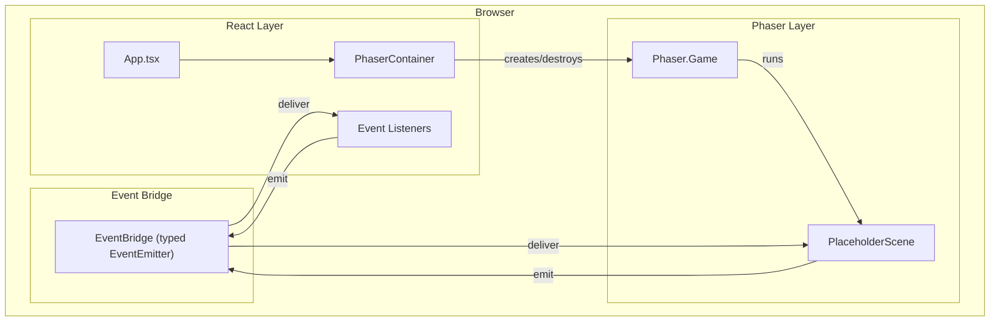

# Design Document — react-phaser-foundation

## Overview

This spec delivers the foundational scaffold for the Paddle Arcade rewrite: a Vite + React 19 + TypeScript + Phaser 3 project with working validation commands, the canonical folder structure, a React component that manages the Phaser lifecycle, and a typed event bridge for bidirectional communication between React and Phaser.

No gameplay logic is included. The deliverable is a green baseline where `build`, `typecheck`, `lint`, and `test` all pass, and a placeholder scene proves the integration works end-to-end.

### Key Design Decisions

| Decision | Choice | ADR |
|----------|--------|-----|
| Build tool | Vite | [ADR-001](decisions/ADR-001-vite-as-build-tool.md) |
| Event bridge pattern | Custom typed EventEmitter | [ADR-002](decisions/ADR-002-event-bridge-pattern.md) |
| Test runner | Vitest + fast-check | [ADR-003](decisions/ADR-003-test-runner-selection.md) |

---

## Architecture



### Ownership Boundaries

| Concern | Owner |
|---------|-------|
| Application mount, DOM root | React |
| Phaser game instance lifecycle | `PhaserContainer` React component |
| Real-time scene loop | Phaser |
| Event type definitions | Shared TypeScript module |
| Event transport | `EventBridge` singleton |
| Build/lint/test configuration | Vite + toolchain configs |

### Data Flow

1. React mounts `PhaserContainer` → creates `Phaser.Game` with config → attaches to a `<div>` ref.
2. Phaser boots `PlaceholderScene` → scene emits a typed event via `EventBridge`.
3. React subscribes to `EventBridge` → receives typed payload → can update state.
4. React emits an event via `EventBridge` → Phaser scene listener receives typed payload.
5. React unmounts `PhaserContainer` → calls `game.destroy(true)` → Phaser cleans up.

---

## Components and Interfaces

### PhaserContainer Component

```typescript
// src/components/PhaserContainer.tsx
interface PhaserContainerProps {
  config?: Partial<Phaser.Types.Core.GameConfig>;
}
```

**Responsibilities:**
- Creates a single `Phaser.Game` instance on mount using `useEffect` with an empty dependency array.
- Attaches the game to a `<div>` element via a React `useRef`.
- Destroys the game instance on unmount via the `useEffect` cleanup function.
- Uses a ref guard to prevent double-instantiation on React strict mode re-renders.

**Lifecycle contract:**
- Mount: create game, attach to DOM.
- Re-render: no-op (game instance is stable in a ref).
- Unmount: `game.destroy(true)` — removes canvas, stops all scenes, releases resources.
- React 19 strict mode (dev only): effects fire twice; ref guard ensures only one game instance is created. The guard checks if `gameRef.current` already exists before instantiating.

### EventBridge

```typescript
// src/game/systems/EventBridge.ts

type EventMap = {
  'placeholder:ping': { timestamp: number };
  // Future events added here with typed payloads
};

interface IEventBridge {
  emit<K extends keyof EventMap>(event: K, payload: EventMap[K]): void;
  on<K extends keyof EventMap>(event: K, handler: (payload: EventMap[K]) => void): void;
  off<K extends keyof EventMap>(event: K, handler: (payload: EventMap[K]) => void): void;
  removeAllListeners(): void;
}
```

**Design principles:**
- Single source of truth for event names and payload shapes — the `EventMap` type.
- Compile-time enforcement: emitting `'placeholder:ping'` with a wrong payload shape is a type error.
- Bidirectional: both Phaser scenes and React components use the same `emit`/`on`/`off` API.
- Singleton instance exported from the module — no dependency injection needed for v1.
- Minimal implementation: a thin wrapper around a `Map<string, Set<Function>>` with typed generics on top.
- No third-party dependency — keeps the bridge lightweight and fully under our control.

### PlaceholderScene

```typescript
// src/game/scenes/PlaceholderScene.ts
class PlaceholderScene extends Phaser.Scene {
  constructor();
  create(): void; // emits 'placeholder:ping' via EventBridge
}
```

**Purpose:** Proves Phaser boots, runs a scene, and communicates through the bridge. Will be replaced by real scenes in later specs.

---

## Data Models

### EventMap (Type Registry)

```typescript
// src/game/types/events.ts
export type EventMap = {
  'placeholder:ping': { timestamp: number };
};
```

This is the single extensible registry. Future specs add entries here. The `EventBridge` implementation is generic over `EventMap`, so adding a new event requires only a type addition — no runtime code changes to the bridge itself.

### Phaser Game Configuration

```typescript
// src/game/config.ts
const gameConfig: Phaser.Types.Core.GameConfig = {
  type: Phaser.AUTO,
  parent: undefined, // set dynamically by PhaserContainer
  width: 800,
  height: 600,
  physics: {
    default: 'arcade',
    arcade: { debug: false },
  },
  scene: [PlaceholderScene],
};
```

### Folder Structure

```
src/
├── app/              # React app shell, root component, providers
│   └── App.tsx
├── components/       # React UI components
│   └── PhaserContainer.tsx
├── game/
│   ├── config.ts     # Phaser game configuration
│   ├── scenes/       # Phaser scenes
│   │   └── PlaceholderScene.ts
│   ├── systems/      # Shared runtime systems
│   │   └── EventBridge.ts
│   ├── rules/        # Pure deterministic game logic (empty for this spec)
│   └── types/        # Shared gameplay types
│       └── events.ts
├── main.tsx          # Vite entry point, renders App
└── vite-env.d.ts     # Vite type declarations
```

### Configuration Files (Project Root)

| File | Purpose |
|------|---------|
| `vite.config.ts` | Vite build config with React plugin |
| `tsconfig.json` | TypeScript strict mode config |
| `tsconfig.node.json` | TypeScript config for Vite/Node files |
| `eslint.config.js` | Flat ESLint config for TS + React |
| `vitest.config.ts` | Vitest config (or inline in vite.config.ts) |
| `package.json` | Dependencies, scripts |
| `index.html` | Vite HTML entry point |

### Package Scripts

```json
{
  "dev": "vite",
  "build": "tsc -b && vite build",
  "typecheck": "tsc --noEmit",
  "lint": "eslint src/",
  "test": "vitest run",
  "preview": "vite preview"
}
```

**Note on `build` script:** `tsc -b` uses TypeScript project references build mode (compiles and checks). If it fails, `vite build` does not run. This is intentional — the production bundle should never be created from code with type errors. The separate `typecheck` script (`tsc --noEmit`) is for fast type-only validation during development.

### Security Considerations

- **Dependency pinning:** Use exact versions for `react`, `react-dom`, and `phaser` in `package.json`. Commit `package-lock.json` to ensure reproducible installs.
- **Listener leak prevention:** React components subscribing to the EventBridge must unsubscribe in their cleanup function (useEffect return). The EventBridge exposes `removeAllListeners()` as a safety valve for scene teardown.
- **CSP:** The `index.html` should include a basic Content-Security-Policy meta tag allowing `'self'`, inline styles (needed by Phaser canvas), and `blob:` for Web Audio buffers. No external script sources.
- **Audit:** Run `npm audit` periodically. Not included in the automated validation commands but recommended before each spec completion.

---


## Correctness Properties

*A property is a characteristic or behavior that should hold true across all valid executions of a system — essentially, a formal statement about what the system should do. Properties serve as the bridge between human-readable specifications and machine-verifiable correctness guarantees.*

### Property 1: Event Bridge payload round-trip preservation

*For any* valid event payload conforming to the `EventMap` type, emitting the event through the `EventBridge` and receiving it on a registered listener SHALL deliver a payload that is deeply equal to the original — no mutation, no loss, no reordering of fields.

**Validates: Requirements 4.2, 4.3, 4.7**

**Test approach:** Use `fast-check` to generate arbitrary `{ timestamp: number }` payloads (including edge cases like `0`, `Number.MAX_SAFE_INTEGER`, negative values, `NaN`, `Infinity`). Emit via `EventBridge.emit`, capture in a listener registered via `EventBridge.on`, assert deep equality.

---

## Error Handling

| Scenario | Behavior |
|----------|----------|
| `PhaserContainer` mounts in strict mode (double effect) | Ref guard prevents second game instance; first instance is reused. |
| `PhaserContainer` unmounts before Phaser finishes booting | `game.destroy(true)` is safe to call at any lifecycle stage. |
| `EventBridge.emit` called with no listeners registered | No-op. No error thrown. Events are fire-and-forget. |
| `EventBridge.off` called with a handler that was never registered | No-op. No error thrown. |
| `EventBridge.removeAllListeners` called | Clears all subscriptions. Safe to call multiple times. |
| Phaser canvas container div removed from DOM unexpectedly | Phaser handles this gracefully via its internal renderer checks. |

---

## Testing Strategy

### Dual Testing Approach

This spec uses both example-based unit tests and property-based tests:

| Test Type | What It Covers |
|-----------|---------------|
| **Property tests (fast-check)** | Event bridge round-trip preservation across random payloads |
| **Unit tests (Vitest)** | PhaserContainer lifecycle (mount/unmount/re-render), EventBridge subscribe/unsubscribe, PlaceholderScene integration |
| **Smoke tests (validation commands)** | `npm run build`, `npm run typecheck`, `npm run lint`, `npm test` all pass |

### Property-Based Test Configuration

- Library: `fast-check` (via Vitest)
- Minimum iterations: 100 per property
- Tag format: `Feature: react-phaser-foundation, Property 1: Event Bridge payload round-trip preservation`

### Test File Locations

| File | Tests |
|------|-------|
| `src/game/systems/EventBridge.test.ts` | Property test for round-trip, unit tests for subscribe/unsubscribe/removeAll |
| `src/components/PhaserContainer.test.tsx` | Mount creates game, unmount destroys game, re-render doesn't duplicate |

### What Is NOT Tested

- Phaser rendering output (no canvas pixel assertions)
- Dev server hot reload behavior
- ESLint rule correctness (trusted upstream)
- Visual appearance of the placeholder scene

### Test Environment

- Vitest with `happy-dom` or `jsdom` environment for React component tests
- Standard Node environment for pure module tests (EventBridge)
- Phaser game instantiation in component tests may require mocking `Phaser.Game` since Phaser expects a real DOM canvas — component tests should verify the lifecycle contract (create/destroy calls) rather than full Phaser boot
