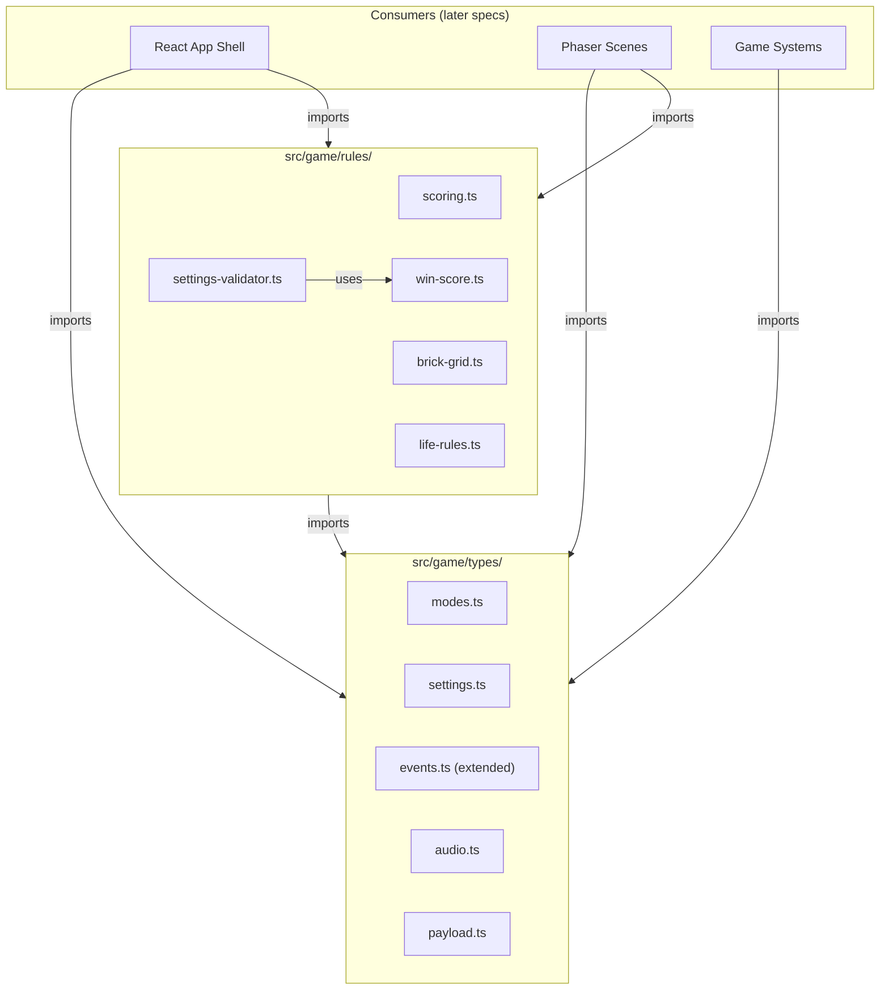

# Design Document — shared-types-and-rules

## Overview

This spec delivers the typed contracts and pure rule modules that all game modes, scenes, and UI components import. It establishes a single source of truth for game mode discrimination, match settings, player identifiers, AI difficulty presets, scene launch payloads, scene-to-React events, and audio event names. It also implements pure deterministic rule functions for Pong scoring, win-score validation, Breakout brick-grid generation, and Breakout life/win/loss logic.

Every type and rule module lives outside Phaser — no Phaser imports allowed. This ensures all game logic is unit-testable and property-testable with fast-check under Vitest without needing a canvas or game instance.

### Key Design Decisions

| Decision | Choice | ADR |
|----------|--------|-----|
| Match settings shape | Discriminated union on `mode` | [ADR-001](decisions/ADR-001-discriminated-union-match-settings.md) |
| Validation error representation | Result type (`Valid | Invalid`) | [ADR-002](decisions/ADR-002-validation-error-representation.md) |

---

## Architecture



### Ownership Boundaries

| Concern | Owner | Location |
|---------|-------|----------|
| Type definitions | Shared TypeScript modules | `src/game/types/` |
| Pure game rules | Shared TypeScript modules | `src/game/rules/` |
| Runtime orchestration | Phaser scenes (later specs) | `src/game/scenes/` |
| UI settings/menus | React components (later specs) | `src/components/` |

### Constraints

- **No Phaser imports** in any file under `src/game/types/` or `src/game/rules/`.
- **No side effects** in rule functions — pure input → output.
- **No mutation** — rule functions return new state, never modify arguments.
- **Readonly types** — match settings are `Readonly` to signal immutability after match start.

---

## Components and Interfaces

### Type Modules

#### `src/game/types/modes.ts`

```typescript
/** The three playable game modes */
export type GameMode = 'pong-solo' | 'pong-versus' | 'breakout';

/** Player position identifiers */
export type PlayerId = 'left' | 'right' | 'solo';

/** AI difficulty presets — shape only, no numeric values */
export type AIDifficultyPreset = 'easy' | 'normal' | 'hard';
```

#### `src/game/types/settings.ts`

```typescript
import type { GameMode, AIDifficultyPreset } from './modes';

/** Base fields shared by all match settings */
interface MatchSettingsBase {
  readonly powerupsEnabled: boolean;
}

/** Pong Solo requires AI difficulty and win score */
export interface PongSoloSettings extends MatchSettingsBase {
  readonly mode: 'pong-solo';
  readonly winScore: number;
  readonly aiDifficulty: AIDifficultyPreset;
}

/** Pong Versus requires win score only */
export interface PongVersusSettings extends MatchSettingsBase {
  readonly mode: 'pong-versus';
  readonly winScore: number;
}

/** Breakout has no win score or AI difficulty */
export interface BreakoutSettings extends MatchSettingsBase {
  readonly mode: 'breakout';
}

/** Discriminated union keyed on `mode` */
export type MatchSettings = PongSoloSettings | PongVersusSettings | BreakoutSettings;
```

#### `src/game/types/audio.ts`

```typescript
/** All named audio cues the game can trigger */
export type AudioEventName =
  | 'audio:paddle-hit'
  | 'audio:wall-bounce'
  | 'audio:brick-break'
  | 'audio:score-point'
  | 'audio:life-loss'
  | 'audio:powerup-pickup'
  | 'audio:pause'
  | 'audio:win'
  | 'audio:loss';
```

#### `src/game/types/payload.ts`

```typescript
import type { MatchSettings } from './settings';
import type { PlayerId } from './modes';

/** Payload passed from React to Phaser when launching a game scene */
export interface SceneLaunchPayload {
  readonly settings: MatchSettings;
  readonly players: readonly PlayerId[];
}
```

#### `src/game/types/events.ts` (extended)

```typescript
import type { PlayerId } from './modes';

/**
 * Central event type registry.
 * All event names and their payload shapes are defined here.
 * The EventBridge uses this type to enforce compile-time safety.
 */
export type EventMap = {
  'placeholder:ping': { timestamp: number };
  'score:update': { left: number; right: number };
  'match:win': { winner: PlayerId };
  'match:loss': { finalScore: number };
  'match:pause': { paused: boolean };
  'lives:update': { remaining: number };
};
```

### Rule Modules

#### `src/game/rules/scoring.ts`

```typescript
import type { PlayerId } from '../types/modes';

/** Immutable score state */
export interface PongScores {
  readonly left: number;
  readonly right: number;
}

/** Result of awarding a point */
export interface ScoreResult {
  readonly scores: PongScores;
  readonly nextServeDirection: 'left' | 'right';
}

/** Which edge the ball exited */
export type ExitEdge = 'left' | 'right';

/**
 * Awards a point based on which edge the ball exited.
 * Ball exiting left → right player scores.
 * Ball exiting right → left player scores.
 * Next serve goes toward the player who lost the point.
 */
export function awardPoint(current: PongScores, exitEdge: ExitEdge): ScoreResult;
```

#### `src/game/rules/win-score.ts`

```typescript
export const WIN_SCORE_MIN = 3;
export const WIN_SCORE_MAX = 21;
export const WIN_SCORE_DEFAULT = 7;

/**
 * Validates and clamps a win score value to the allowed range [3, 21].
 * - Rounds non-integers to nearest integer.
 * - Clamps below 3 to 3, above 21 to 21.
 * - Returns default (7) for undefined/null/NaN.
 */
export function validateWinScore(value?: number | null): number;
```

#### `src/game/rules/brick-grid.ts`

```typescript
/** Configuration for brick grid generation */
export interface BrickGridConfig {
  readonly rows: number;
  readonly columns: number;
  readonly playAreaWidth: number;
  readonly playAreaHeight: number;
  readonly topOffset: number;
  readonly padding: number;
}

/** A single brick descriptor */
export interface BrickDescriptor {
  readonly x: number;
  readonly y: number;
  readonly width: number;
  readonly height: number;
}

/**
 * Generates a grid of non-overlapping brick descriptors that fit within bounds.
 * Returns empty array for zero or negative rows/columns.
 */
export function generateBrickGrid(config: BrickGridConfig): BrickDescriptor[];
```

#### `src/game/rules/life-rules.ts`

```typescript
/** Breakout match state */
export interface BreakoutState {
  readonly lives: number;
  readonly bricksRemaining: number;
  readonly score: number;
}

/** Match status */
export type MatchStatus = 'in-progress' | 'win' | 'loss';

export const STARTING_LIVES = 3;

/** Creates initial breakout state */
export function createInitialState(totalBricks: number): BreakoutState;

/** Decrements lives by 1. Never goes below 0. */
export function loseLife(state: BreakoutState): BreakoutState;

/** Decrements bricks remaining and adds score */
export function breakBrick(state: BreakoutState, points: number): BreakoutState;

/** Determines current match status */
export function getMatchStatus(state: BreakoutState): MatchStatus;
```

#### `src/game/rules/settings-validator.ts`

```typescript
import type { MatchSettings } from '../types/settings';

/** Validation result — either valid with clamped settings, or invalid with error details */
export type ValidationResult =
  | { readonly valid: true; readonly settings: MatchSettings }
  | { readonly valid: false; readonly errors: readonly string[] };

/**
 * Validates match settings for the specified mode.
 * - Clamps winScore via validateWinScore when present.
 * - Ensures required fields exist for the given mode.
 * - Returns a new validated copy, never mutates input.
 */
export function validateSettings(input: unknown): ValidationResult;
```

---

## Data Models

### Score State (Pong)

```typescript
interface PongScores {
  readonly left: number;   // left player's score, >= 0
  readonly right: number;  // right player's score, >= 0
}
```

**Invariant:** `left + right === totalPointsPlayed`

### Breakout State

```typescript
interface BreakoutState {
  readonly lives: number;           // >= 0, starts at 3
  readonly bricksRemaining: number; // >= 0
  readonly score: number;           // >= 0
}
```

**Invariants:**
- `lives >= 0` (never negative)
- `bricksRemaining >= 0`
- When `bricksRemaining === 0` → status is `'win'`
- When `lives === 0` → status is `'loss'`

### Brick Descriptor

```typescript
interface BrickDescriptor {
  readonly x: number;      // left edge x-coordinate
  readonly y: number;      // top edge y-coordinate
  readonly width: number;  // > 0
  readonly height: number; // > 0
}
```

**Invariants:**
- No two bricks overlap (their bounding rectangles do not intersect)
- Every brick fits within `[0, playAreaWidth] × [topOffset, playAreaHeight]`
- Total count equals `rows × columns` for valid inputs

### Validation Result

```typescript
type ValidationResult =
  | { readonly valid: true; readonly settings: MatchSettings }
  | { readonly valid: false; readonly errors: readonly string[] };
```

This tagged union pattern lets consumers branch on `result.valid` and get type-narrowed access to either the validated settings or the error list. It avoids exceptions for expected validation failures and keeps the function pure.


---

## Correctness Properties

*A property is a characteristic or behavior that should hold true across all valid executions of a system — essentially, a formal statement about what the system should do. Properties serve as the bridge between human-readable specifications and machine-verifiable correctness guarantees.*

### Property 1: Score sum equals total points played

*For any* sequence of point awards (each being a ball exit from either the left or right edge), applying `awardPoint` repeatedly from an initial score of `{left: 0, right: 0}` SHALL produce final scores where `left + right` equals the length of the sequence.

**Validates: Requirements 7.6, 7.3**

### Property 2: Serve direction toward losing player

*For any* valid `PongScores` and any `ExitEdge`, calling `awardPoint` SHALL return a `nextServeDirection` equal to the `exitEdge` value (the serve goes toward the side that lost the point).

**Validates: Requirements 7.4**

### Property 3: Win-score validation always produces valid range

*For any* numeric input (including negative numbers, zero, fractions, very large values, Infinity, and -Infinity), `validateWinScore` SHALL return an integer in the range [3, 21] inclusive.

**Validates: Requirements 8.6, 8.1, 8.2, 8.3, 8.5**

### Property 4: Brick grid no-overlap

*For any* valid `BrickGridConfig` with positive rows and columns, no two `BrickDescriptor` values returned by `generateBrickGrid` SHALL have overlapping bounding rectangles (i.e., for any pair of bricks A and B, either A's right edge ≤ B's left edge, A's left edge ≥ B's right edge, A's bottom edge ≤ B's top edge, or A's top edge ≥ B's bottom edge).

**Validates: Requirements 9.3**

### Property 5: Brick grid fits bounds

*For any* valid `BrickGridConfig` with positive rows and columns, every `BrickDescriptor` returned by `generateBrickGrid` SHALL satisfy: `x >= 0`, `y >= topOffset`, `x + width <= playAreaWidth`, and `y + height <= playAreaHeight`.

**Validates: Requirements 9.4**

### Property 6: Brick grid correct count

*For any* valid `BrickGridConfig` with positive rows and columns, `generateBrickGrid` SHALL return exactly `rows × columns` brick descriptors.

**Validates: Requirements 9.5, 9.2**

### Property 7: Life count never goes negative

*For any* `BreakoutState` (including states where `lives` is already 0), calling `loseLife` SHALL produce a state where `lives >= 0`.

**Validates: Requirements 10.7, 10.2**

### Property 8: Match status determined by lives and bricks

*For any* `BreakoutState`:
- When `lives === 0` and `bricksRemaining > 0`, `getMatchStatus` SHALL return `'loss'`.
- When `bricksRemaining === 0`, `getMatchStatus` SHALL return `'win'`.
- When `lives > 0` and `bricksRemaining > 0`, `getMatchStatus` SHALL return `'in-progress'`.

**Validates: Requirements 10.3, 10.4, 10.5**

### Property 9: Settings validation clamps winScore to valid range

*For any* input object with mode `'pong-solo'` or `'pong-versus'` that includes all required fields and a numeric `winScore`, `validateSettings` SHALL return a valid result whose `settings.winScore` is an integer in [3, 21].

**Validates: Requirements 11.4**

### Property 10: Rule functions do not mutate inputs

*For any* input to `awardPoint`, `validateWinScore`, `generateBrickGrid`, `loseLife`, `breakBrick`, or `validateSettings`, calling the function SHALL not modify the input object (a deep-equality check of the input before and after the call SHALL pass).

**Validates: Requirements 7.5, 8.7, 9.7, 10.6, 11.5, 11.7**

---

## Error Handling

### Validation Error Representation

Validation errors use a tagged union result type rather than thrown exceptions:

```typescript
type ValidationResult =
  | { readonly valid: true; readonly settings: MatchSettings }
  | { readonly valid: false; readonly errors: readonly string[] };
```

| Scenario | Behavior |
|----------|----------|
| Missing required field for mode | Returns `{ valid: false, errors: ['Missing required field: aiDifficulty'] }` |
| Invalid mode value | Returns `{ valid: false, errors: ['Invalid mode: ...'] }` |
| winScore out of range | Clamps silently (not an error — clamping is expected behavior) |
| Non-integer winScore | Rounds silently (not an error — rounding is expected behavior) |
| Null/undefined winScore for Pong modes | Returns `{ valid: false, errors: ['Missing required field: winScore'] }` |
| Zero or negative brick grid dimensions | Returns empty array (not an error — defined behavior) |
| loseLife called with 0 lives | Returns state unchanged (lives stays at 0, never goes negative) |

### Design Rationale

- **No exceptions for expected failures**: Settings validation failures are expected user-input scenarios, not exceptional conditions. Using a result type keeps control flow explicit and avoids try/catch in callers.
- **Silent clamping for numeric ranges**: Win-score clamping is a convenience feature, not an error. The UI can display the clamped value without showing an error message.
- **Defensive lower bound on lives**: Rather than throwing when lives is already 0, `loseLife` is idempotent at the boundary. This prevents runtime crashes if a scene accidentally calls it twice.

---

## Testing Strategy

### Dual Testing Approach

| Test Type | What It Covers |
|-----------|---------------|
| **Property tests (fast-check)** | All 10 correctness properties above — universal invariants across random inputs |
| **Unit tests (Vitest)** | Specific examples, edge cases, error messages, type compilation checks |

### Property-Based Test Configuration

- **Library:** `fast-check` (already installed, integrates with Vitest)
- **Minimum iterations:** 100 per property test
- **Tag format:** `Feature: shared-types-and-rules, Property N: <property_text>`

### Test File Locations

| File | Tests |
|------|-------|
| `src/game/rules/scoring.test.ts` | Property 1 (score sum), Property 2 (serve direction), unit tests for specific edge/exit scenarios |
| `src/game/rules/win-score.test.ts` | Property 3 (valid range), unit tests for default, null, NaN, boundary values |
| `src/game/rules/brick-grid.test.ts` | Property 4 (no-overlap), Property 5 (fits bounds), Property 6 (correct count), unit tests for zero/negative inputs |
| `src/game/rules/life-rules.test.ts` | Property 7 (non-negative lives), Property 8 (status determination), unit tests for initial state, win/loss transitions |
| `src/game/rules/settings-validator.test.ts` | Property 9 (winScore clamping), unit tests for missing fields, error messages, mode-specific validation |
| `src/game/rules/no-mutation.test.ts` | Property 10 (input immutability) — tests all rule functions in one file |

### Unit Test Coverage

Unit tests complement property tests by covering:
- Specific examples that demonstrate correct behavior (e.g., ball exits left → right scores)
- Edge cases explicitly called out in requirements (e.g., zero rows, null winScore, NaN)
- Error message content (e.g., "Missing required field: aiDifficulty")
- Type compilation smoke tests (importing types and constructing valid values)

### What Is NOT Tested

- Phaser scene integration (no Phaser in these modules)
- React component rendering (types are consumed by later specs)
- Runtime performance of brick grid generation
- Visual output of any kind

### Test Environment

- Standard Node environment (no DOM needed — all modules are pure TypeScript)
- `vitest run` for single execution
- `fast-check` for property generation with minimum 100 iterations
